# 实验报告

## 1. 序言

- ### 1.1 概述

  本次实验我们小组基于C语言设计并实现了一个类C语言的编译器，该系统以符合C语言基本语法规则的代码文本作为输入，输出为指定机器的目标代码，该C编译器的设计实现涵盖词法分析、语法分析、语义分析、代码生成等阶段和环节，所使用的的具体技术包括但不限于：

  - Flex实现词法分析
  - Bison实现语法分析
  - LLVM实现中间代码生成、目标代码生成
  - json实现AST可视化

  该编译器，目前可以支持

  - 数据类型
    - 内置类型int,char,bool,float
    - 数组类型
    - 结构体类型
    - 数组指针
  - 表达式
    - 一元操作：Minus
    - 二元操作: MUL DIV NOT ADD SUB NE,AND OR GE GT LE LT EQ
    - 变量引用
    - 数组引用
  - 语句
    - 赋值语句
    - 复合语句
    - 嵌套语句
    - 分支语句
    - 循环语句
  - 函数
    - 函数的声明、调用
    - 系统IO函数：cin、cout
    - 值传递和引用传递
  - 可视化
    - AST可视化

### 1.2 开发环境

- 操作系统：Linux
- 编译环境
  - Flex 2.5.35
  - Bison 2.3
  - LLVM 6.0.0

### 1.3 文件说明

本次提交的文件及其说明如下、

- srcCode: 源代码文件夹
  - compiler.l ：Flex源代码，主要实现词法分析，生成Token
  - compiler.y: Yacc源代码，主要实现语法分析，生成抽象语法树
  - tokenizer.cpp：Flex根据compiler.l生成的词法分析器
  - parser.cpp：Yacc根据compiler.y生成的语法分析器C++文件
  - parser.hpp：Yacc根据compiler.y生成的语法分析器头文件
  - ast.hh：AST函数类声明头文件
  - ast.cpp
  - ObjGen.cpp
  - ObjGen.h
- doc: 报告文档文件夹
  - report.pdf
- test: 测试代码及工具文件夹
  - test1.cmm
  - test2.cmm
  - test3.cmm

### 1.4 组员分工

| 组员   | 具体分工                                           |
| ------ | -------------------------------------------------- |
| 赵晨旭 | 词法分析，语法分析，AST可视化                      |
| 杨心妤 | 语义分析，中间代码生成，运行环境设计，目标代码生成 |
| 李洁   | 语义分析，中间代码生成，运行环境设计，目标代码生成 |


## 2. 词法分析

### 2.1 FLEX 概述

Lex 是一个词法分析器的生成工具，它支持使用正则表达式来描述各个词法单元的模式，由此给出一个词法分析器的规约，并生成相应的实现代码。 Lex 程序的输入方法称为 Lex 语言，而 Lex 程序本身被称为 Lex 编译器。

一个Lex程序通常有如下形式：

```
声明部分
%%
转换规则
%%
辅助函数
```

其中声明部分通常包括`变量`，`明示常量`和正则表达式的定义，`明示常量`是一个值为数字的标识符，用来表示词法单元的类型。

转换规则具有如下的形式: `模式 { 动作 }`。每个模式是一个正则表达式，可以使用声明部分给出的正则定义。动作部分是代码片段，通常用 C 语言编写。

辅助函数这个部分中定义了各个动作所需要的函数，也可以包含 main 函数，这部分的代码将会放到输出的 C 代码中。

### 2.2 正则表达式。

| 字符           | 描述描述                                                     |
| -------------- | ------------------------------------------------------------ |
| `\``\`         | 将下一个字符标记为一个特殊字符（File Format Escape，清单见本表）、或一个原义字符（Identity Escape，有^$()*+?.[\{\|共计12个)、或一个向后引用（backreferences）、或一个八进制转义符。例如，“`n`”匹配字符“`n`”。“`\n`”匹配一个换行符。序列“`\\`”匹配“`\`”而“`\(`”则匹配“`(`”。将下一个字符标记为一个特殊字符（File Format Escape，清单见本表）、或一个原义字符（Identity Escape，有^$()*+?.[\{|共计12个)、或一个向后引用（backreferences）、或一个八进制转义符。例如，“`n`”匹配字符“`n`”。“`\n`”匹配一个换行符。序列“`\\`”匹配“`\`”而“`\(`”则匹配“`(`”。 |
| `^``^`         | 匹配输入字符串的开始位置。如果设置了RegExp对象的Multiline属性，^也匹配“`\n`”或“`\r`”之后的位置。匹配输入字符串的开始位置。如果设置了RegExp对象的Multiline属性，^也匹配“`\n`”或“`\r`”之后的位置。 |
| `$``$`         | 匹配输入字符串的结束位置。如果设置了RegExp对象的Multiline属性，$也匹配“`\n`”或“`\r`”之前的位置。匹配输入字符串的结束位置。如果设置了RegExp对象的Multiline属性，$也匹配“`\n`”或“`\r`”之前的位置。 |
| `*`            | 匹配前面的子表达式零次或多次。例如，zo*能匹配“`z`”、“`zo`”以及“`zoo`”。*等价于{0,}。 |
| `+`            | 匹配前面的子表达式一次或多次。例如，“`zo+`”能匹配“`zo`”以及“`zoo`”，但不能匹配“`z`”。+等价于{1,}。 |
| `?`            | 匹配前面的子表达式零次或一次。例如，“`do(es)?`”可以匹配“`does`”中的“`do`”和“`does`”。?等价于{0,1}。 |
| `{n}`          | *n*是一个非负整数。匹配确定的*n*次。例如，“`o{2}`”不能匹配“`Bob`”中的“`o`”，但是能匹配“`food`”中的两个o。 |
| `{n,}`         | *n*是一个非负整数。至少匹配*n*次。例如，“`o{2,}`”不能匹配“`Bob`”中的“`o`”，但能匹配“`foooood`”中的所有o。“`o{1,}`”等价于“`o+`”。“`o{0,}`”则等价于“`o*`”。 |
| `{n,m}`        | *m*和*n*均为非负整数，其中*n*<=*m*。最少匹配*n*次且最多匹配*m*次。例如，“`o{1,3}`”将匹配“`fooooood`”中的前三个o。“`o{0,1}`”等价于“`o?`”。请注意在逗号和两个数之间不能有空格。 |
| `?`            | 非贪心量化（Non-greedy quantifiers）：当该字符紧跟在任何一个其他重复修饰符（*,+,?，{*n*}，{*n*,}，{*n*,*m*}）后面时，匹配模式是**非**贪婪的。非贪婪模式尽可能少的匹配所搜索的字符串，而默认的贪婪模式则尽可能多的匹配所搜索的字符串。例如，对于字符串“`oooo`”，“`o+?`”将匹配单个“`o`”，而“`o+`”将匹配所有“`o`”。 |
| `.`            | 匹配除“`\r`”“`\n`”之外的任何单个字符。要匹配包括“`\r`”“`\n`”在内的任何字符，请使用像“`(.|\r|\n)`”的模式。 |
| `(pattern)`    | 匹配pattern并获取这一匹配的子字符串。该子字符串用于向后引用。所获取的匹配可以从产生的Matches集合得到，在VBScript中使用SubMatches集合，在JScript中则使用$0…$9属性。要匹配圆括号字符，请使用“`\(`”或“`\)`”。可带数量后缀。 |
| `(?:pattern)`  | 匹配pattern但不获取匹配的子字符串（shy groups），也就是说这是一个非获取匹配，不存储匹配的子字符串用于向后引用。这在使用或字符“`(|)`”来组合一个模式的各个部分是很有用。例如“`industr(?:y|ies)`”就是一个比“`industry|industries`”更简略的表达式。 |
| `(?=pattern)`  | 正向肯定预查（look ahead positive assert），在任何匹配pattern的字符串开始处匹配查找字符串。这是一个非获取匹配，也就是说，该匹配不需要获取供以后使用。例如，“`Windows(?=95|98|NT|2000)`”能匹配“`Windows2000`”中的“`Windows`”，但不能匹配“`Windows3.1`”中的“`Windows`”。预查不消耗字符，也就是说，在一个匹配发生后，在最后一次匹配之后立即开始下一次匹配的搜索，而不是从包含预查的字符之后开始。 |
| `(?!pattern)`  | 正向否定预查（negative assert），在任何不匹配pattern的字符串开始处匹配查找字符串。这是一个非获取匹配，也就是说，该匹配不需要获取供以后使用。例如“`Windows(?!95|98|NT|2000)`”能匹配“`Windows3.1`”中的“`Windows`”，但不能匹配“`Windows2000`”中的“`Windows`”。预查不消耗字符，也就是说，在一个匹配发生后，在最后一次匹配之后立即开始下一次匹配的搜索，而不是从包含预查的字符之后开始 |
| `(?<=pattern)` | 反向（look behind）肯定预查，与正向肯定预查类似，只是方向相反。例如，“`(?<=95|98|NT|2000)Windows`”能匹配“`2000Windows`”中的“`Windows`”，但不能匹配“`3.1Windows`”中的“`Windows`”。 |
| `(?<!pattern)` | 反向否定预查，与正向否定预查类似，只是方向相反。例如“`(?<!95|98|NT|2000)Windows`”能匹配“`3.1Windows`”中的“`Windows`”，但不能匹配“`2000Windows`”中的“`Windows`”。 |
| `x|y`          | 没有包围在()里，其范围是整个正则表达式。例如，“`z|food`”能匹配“`z`”或“`food`”。“`(?:z|f)ood`”则匹配“`zood`”或“`food`”。 |
| `[xyz]`        | 字符集合（character class）。匹配所包含的任意一个字符。例如，“`[abc]`”可以匹配“`plain`”中的“`a`”。特殊字符仅有反斜线\保持特殊含义，用于转义字符。其它特殊字符如星号、加号、各种括号等均作为普通字符。脱字符^如果出现在首位则表示负值字符集合；如果出现在字符串中间就仅作为普通字符。连字符 - 如果出现在字符串中间表示字符范围描述；如果如果出现在首位（或末尾）则仅作为普通字符。右方括号应转义出现，也可以作为首位字符出现。 |
| `[^xyz]`       | 排除型字符集合（negated character classes）。匹配未列出的任意字符。例如，“`[^abc]`”可以匹配“`plain`”中的“`plin`”。 |
| `[a-z]`        | 字符范围。匹配指定范围内的任意字符。例如，“`[a-z]`”可以匹配“`a`”到“`z`”范围内的任意小写字母字符。 |
| `[^a-z]`       | 排除型的字符范围。匹配任何不在指定范围内的任意字符。例如，“`[^a-z]`”可以匹配任何不在“`a`”到“`z`”范围内的任意字符。 |
| `[:name:]`     | 增加命名字符类（named character class）[[注 1\]](https://zh.wikipedia.org/wiki/正则表达式#cite_note-2)中的字符到表达式。只能用于**方括号表达式**。 |
| `[=elt=]`      | 增加当前locale下排序（collate）等价于字符“elt”的元素。例如，[=a=]可能会增加ä、á、à、ă、ắ、ằ、ẵ、ẳ、â、ấ、ầ、ẫ、ẩ、ǎ、å、ǻ、ä、ǟ、ã、ȧ、ǡ、ą、ā、ả、ȁ、ȃ、ạ、ặ、ậ、ḁ、ⱥ、ᶏ、ɐ、ɑ 。只能用于方括号表达式。 |
| `[.elt.]`      | 增加[排序元素](https://zh.wikipedia.org/wiki/Collation)（collation element）elt到表达式中。这是因为某些排序元素由多个字符组成。例如，29个字母表的西班牙语， "CH"作为单个字母排在字母C之后，因此会产生如此排序“cinco, credo, chispa”。只能用于方括号表达式。 |
| `\b`           | 匹配一个单词边界，也就是指单词和空格间的位置。例如，“`er\b`”可以匹配“`never`”中的“`er`”，但不能匹配“`verb`”中的“`er`”。 |
| `\B`           | 匹配非单词边界。“`er\B`”能匹配“`verb`”中的“`er`”，但不能匹配“`never`”中的“`er`”。 |
| `\cx`          | 匹配由x指明的控制字符。x的值必须为`A-Z`或`a-z`之一。否则，将c视为一个原义的“`c`”字符。控制字符的值等于x的值最低5比特（即对3210进制的余数）。例如，\cM匹配一个Control-M或回车符。\ca等效于\u0001, \cb等效于\u0002, 等等… |
| `\d`           | 匹配一个数字字符。等价于[0-9]。注意Unicode正则表达式会匹配全角数字字符。 |


### 2.3 具体代码实现

#### 2.3.1定义区

我们的Lex源程序在定义区导入了需要的头文件，包括ast.hh（抽象语法树头文件）、parser.hpp（yacc
生成的词法分析器头文件）、iostream（C++标准输入输出头文件）、string（C++ std::string头文
件），然后声明了lex需要的yywrap函数。

```
%{
#include "ast.hh"
#include <string>
#include <iostream>
#include "parser.hpp"

#define SAVE_TOKEN yylval.sVal = new std::string(yytext);
%}
```

#### 2.3.2规则区

首先在这部分我们要先排除空格换行对解析程序的干扰：

```
[ \t\n]                                                 ;
```

然后我们对C语言的关键字，运算符等进行解析：

```
    /* 符号部分 */
"("                                                     {return LP;}
")"                                                     {return RP;} 
"["                                                     {return LB;}
"]"                                                     {return RB; }
"{"                                                     {return LCB;}
"}"                                                     {return RCB;}
"."                                                     {return DOT;}
","                                                     {return COMMA;}
":"                                                     {return COLON;}
"*"                                                     {return MUL;}
"/"                                                     {return DIV;} 
"~"                                                     {return NOT;}
"+"                                                     {return ADD;}
"-"                                                     {return SUB;}
"!="                                                    {return NE;}
"&&"                                                    {return AND;}
"||"                                                    {return OR;}
">="                                                    {return GE;}
">"                                                     {return GT; }
"<="                                                    {return LE;} 
"<"                                                     {return LT;} 
"=="                                                    {return EQ;} 
"="                                                     {return ASSIGN;} 
";"                                                     {return SEMI;} 
"<<"                                                    {return LD;}
">>"                                                    {return RD;}    
"%"                                                     {return MOD;}
    /* 关键字部分 */
if                                                      {return IF;}
else                                                    {return ELSE;}
while                                                   {return WHILE;}
signed                                                  {return SIGNED;}
throw                                                   {return UNION;}
this                                                    {return THIS;}
unsigned                                                {return UNSIGNED;}
const                                                   {return CONST;}
goto                                                    {return GOTO;}
virtual                                                 {return VIRTUAL;}
for                                                     {return FOR;}
float                                                   {return FLOAT;}
break                                                   {return BREAK;}
auto                                                    {return AUTO;}
class                                                   {return CLASS;}
operator                                                {return OPERATOR;}
case                                                    {return CASE;}
do                                                      {return DO;}
long                                                    {return LONG;}
typedef                                                 {return TYPEDEF;}
static                                                  {return STATIC;}
friend                                                  {return FRIEND;}
template                                                {return TEMPLATE;}
default                                                 {return DEFAULT;}
new                                                     {return NEW;}
setw                                                    {return SETW;}


register                                                {return REGISTER;}
return                                                  {return RETURN;}
enum                                                    {return ENUM;}
inline                                                  {return INLINE;}
try                                                     {return TRY;}
short                                                   {return SHORT;}
continue                                                {return CONTINUE;}
sizeof                                                  {return SIZEOF;}
switch                                                  {return SWITCH;}
private                                                 {return PRIVATE;}
protected                                               {return PROTECTED;}
asm                                                     {return ASM;}
catch                                                   {return CATCH;}
delete                                                  {return DELETE;}
public                                                  {return PUBLIC;}
volatile                                                {return VOLATILE;}
struct                                                  {return STRUCT;}
printf                                                  {return PRINTF;}
scanf                                                   {return SCANF;}
main                                                    {return MAIN;}
cin                                                     {return CIN;}
cout                                                    {return COUT;}
endl                                                    {return ENDL;}


"int"|"char"|"double"|"boolean"|"string"|"void"         SAVE_TOKEN; return SYS_TYPE;  
"false"|"true"                                          SAVE_TOKEN; return SYS_BOOL;                                               

```

其中SYS_TYPE在yacc文件中定义，表式数据类型。

需要额外保存数值的内容也需要解析并保存

```
 ANY .
NQUOTE  [^"']
COMMENT "{"{ANY}*"}" 
DIGIT [0-9]
DIGITS {DIGIT}+
LETTER [_a-zA-Z]
ID {LETTER}({LETTER}|{DIGIT})*
POINT "."{DIGITS}
EXPONENT (e|E)("+"|"-")?{DIGITS}
INTNUM {DIGITS}
REALNUM {DIGITS}({POINT})?({EXPONENT})?
STRING "\""({LETTER}|{DIGIT}|{NQUOTE})*"\""
 
 /* 数字，变量名，字符和字符串 */
{ID}                                                    SAVE_TOKEN; return IDENTIFIER;
{DIGITS}\.{DIGITS}                                      SAVE_TOKEN; yylval.floatVal=atof(yylval.sVal->c_str()); return REAL; 
{DIGITS}                                                SAVE_TOKEN; yylval.intVal=atoi(yylval.sVal->c_str()); return INTEGER;

{STRING}                                                SAVE_TOKEN; yylval.sVal=yylval.sVal; return STRING;

```

对于整型和浮点型数值可以在parse阶段就将其转换为对应类型的变量而保存。

## 3. 语法分析

语法分析是编译过程的一个逻辑阶段。语法分析的任务是在词法分析的基础上将单词序列组合成各类语法短语，如程序，语句，表达式等等.语法分析程序判断源程序在结构上是否正确.源程序的结构由上下文无关文法描述.语法分析程序可以用YACC等工具自动生成。

### 3.1 Yacc 概述

Yacc(Yet Another Compiler Compiler)，是Unix/Linux上一个用来生成编译器的编译器（编译器代码生成器）.使用BNF定义语法，能处理上下文无关文法(context-free)。出现在每个产生式左边(left-hand side：lhs)的符号是非终端符号，出现在产生式右边(right-hand side：rhs)的符号有非终端符号和终端符号，但终端符号只出现在右端。

Yacc是开发编译器的一个有用的工具,采用LR（1）（实际上是LALR(1)）语法分析方法。
LR(k)分析方法是1965年Knuth提出的，括号中的k（k >=0）表示向右查看输入串符号的个数。LR分析法正视给出一种能根据当前分析栈中的符号串和向右顺序查看输入串的k个符号就可唯一确定分析器的动作是移进还是规约和用哪个产生式规约。

这种方法具有分析速度快，能准确，即使地指出出错的位置，它的主要缺点是对于一个使用语言文法的分析器的构造工作量相当大，k愈大构造愈复杂，实现比较困难。

与Lex相似，Yacc的输入文件由以%%分割的三部分组成，分别是声明区，规则区和程序区，三部分的功能与Lex相似，不同的是规则区的正则表达式替换为CFG，在声明区要提前声明好使用到的终结符以及非终结符的类型

```
declaration
%%
rules
%%
programs
```


### 3.2 抽象语法树节点类简介

语法分析器的输出是抽象语法树。在计算机科学中，抽象语法树是源代码语法结构的一种抽象表示。它
以树状的形式表现编程语言的语法结构，树上的每个节点都表示源代码中的一种结构。之所以说语法是
“抽象”的，是因为这里的语法并不会表示出真实语法中出现的每个细节.

以下是我们所设计的编译器的抽象语法树的继承体系：


#### 3.2.1 _Node类

_Node类是一个抽象类，其意义为抽象语法书的节点，这是抽象语法树所有的节点的共同祖先，该类拥有两个纯虚函数，分别为`codeGen`和`jsonGen`，分别用于生产中间代码和AST可视化的Json数据。

```c++
class Node
{
public:
    virtual ~Node(){} 
    virtual void setNodeType(NodeType type){
        this->type=type;
    }

    virtual llvm::Value *codeGen(CodeGenerator & generator) = 0;
    virtual string JsonGen()=0;
private:
    int type;
};
```

#### 3.2.2 _Program类

_Program类是抽象语法树的根节点，意味着程序开始，内有两个成员变量`_FunctionList*`类型的指针`myFuncs`是程序中所有函数结构的指针Vector容器，以及`_StructList`类型的指针`myStructs`用于存储程序中所有结构体的定义结构指针的Vector容器。其中构造函数分别对应有无struct的程序定义，同时也有两个类内函数`bool hasStruct()`来判断程序有无结构体定义, 若存在`_Struct* getStructPtr(string* name)`则用于返回对应的名称`name`结构体指针。

```c++
class _Program: public Node{
public:
    _FunctionList *myFuncs;
    _StructList *myStructs;
    _Program(_StructList *structs,_FunctionList *Funcs){
        ···
    }
    _Program(){
        ···
    }
    bool hasStruct(){
        ···
    }

    _Struct* getStructPtr(string* name){
        ····
    }
    virtual llvm::Value *codeGen(CodeGenerator & generator) override;
    virtual string JsonGen() override;
};
```


#### 3.2.3 _Struct类

_Struct类用来存储struct结构体声明时的结构内容，类内有两个成员变量`_DefinitionList*`类型的`defins`用于指向存储结构体的每条内部变量的声明语句类指针vector容器，`_struct_ID`用于存储结构体的名称。其中除了构造函数外，另有两个成员函数`int getIndex(std::string name)`用于获得结构体内部变量的`index`，用于`llvm`引用操作,`string getId(int index)`则反之用于获得对应`index`的成员变量的名称。

```c++
class _Struct:public Node{
public:
    _DefinitionList* defins;
    std::string* struct_ID;

    _Struct(std::string* name,_DefinitionList* definitions ){
        ···
    }

    int getIndex(std::string name){
        ···
    }

    string getId(int index){
        ···
    }
    virtual llvm::Value *codeGen(CodeGenerator & generator) override;
    virtual string JsonGen() override;
};
```


#### 3.2.4 _Definition类

_Definition类用于存储单条定义语句的内容信息，内有四个成员变量：`BuildInType`类型的`def_Type`用于保存定义数据的类型信息，`bool`类型的`isStruct`用于标识是否为结构体定义语句，若为`true`则`string*`类型的`structID`用于存储`struct`结构的名称，`_DataList*`类型的`data`是存储被定义变量的`identifier`的vector容器指针，可以通过该指针访问这些`_Data`类指针。不同的构造函数分别用于`sys_Type`类型变量的声明语句，和结构体变量的声明。`string getStructID()`用于获得struct名称。

```c++
class _Definition: public Node{
public:
    BuildInType def_Type;
    bool isStruct;
    string* structID;
    _DataList* data;
    _Definition(std::string* type, _DataList* var){
        ···  
    }
    _Definition(int type,std::string* ID,_DataList*var){
        ···
    }
    string getStructID(){
        ···
    }

    virtual llvm::Value *codeGen(CodeGenerator & generator) override;
    virtual string JsonGen() override;
};
```


#### 3.2.5 _Function类

_Function类用于存储程序单个方程内容信息，内有两个成员变量，`union u_Function`类型的`v_Function`，内有两个指针变量`_mainFunction*`类型的`mainFunc`和`_Subroutine`类型的`subFunc`，通过`enum`类型的变量`v_Type`的值选择判断。同样的，构造函数也通过指针类型进行区分。

```c++
class _Function:public Node{
public:
    union u_Function{
        _mainFunction* mainFunc;
         _Subroutine* subFunc;
    }v_Function;

    enum u_Type{
        MAIN,
        SUB
    }v_Type;

    _Function(_mainFunction* mainFunc){
        ···
    }
    _Function(_Subroutine* subFunc){
        ···
    }

    virtual llvm::Value *codeGen(CodeGenerator & generator) override;
    virtual string JsonGen() override;
};
```

#### 3.2.6 _mainFunction类

_mainFunction类用于保存main函数的内容信息：内有两个成员变量：`_StatementList*`类型的`statements`是`statement*`的vector容器指针，用于保存main函数内的所有语句信息，`_ArgsDefinitionList`类型的参数`args`是`_Data*`类型的指针vector容器,用于保存main函数的参数信息。

```c++
class _mainFunction: public Node{
public:
    _StatementList* statements;
    _ArgsDefinitionList* args;
    _mainFunction(_ArgsDefinitionList* _args, _StatementList* _statements){
        ...
    }

    virtual llvm::Value *codeGen(CodeGenerator & generator) override;
    virtual string JsonGen() override;
};
```

#### 3.2.7 _Subroutine类

_Subroutine类用于保存自定义函数的内容信息：内有四个成员变量：`_StatementList*`类型的`statements`是`statement*`的vector容器指针，用于保存函数内的所有语句信息，`_ArgsDefinitionList`类型的参数`args`是`_Data*`类型的指针vector容器,用于保存函数的参数信息。`string*`类型的`Type`用于保存函数返回类型信息，`string*`的`Func_ID`用于保存函数的名称

```c++
class _Subroutine:public Node{
public:
    _StatementList* statements;
    std::string* Type; /* "int"|"char"|"double"|"boolean"|"void" */
    std::string* Func_Id;  /* Function Identifier */
    _ArgsDefinitionList* args; 
    _Subroutine(std::string* Type,std::string* Identifier,_ArgsDefinitionList* _args, _StatementList* _statements){
        ···
    }

    virtual llvm::Value *codeGen(CodeGenerator & generator) override;
   	virtual string JsonGen() override;
};
```

#### 3.2.8 _Statement类

_Statement类用于保存函数单个语句内容信息：内有两个成员变量，`union u_Statement`类型的`v_Statement`内有5种类型的指针，分别为对应具体语句类型的指针，该类型由另一成员变量`enum u_Type`类型的`v_Type`的值判断。根据语句的具体内容的不同，\_Statement类使用不同的构造函数。

```c++
class _Statement: public Node{
public:
    union u_Statement{
        _Definition* definStatement;
        _Expression* exprStatement;
        _returnStatement* returnStatement;
        _Output* outputExpr;
        _Input* inputExpr;
    }v_Statement;
    enum u_Type{
        DEFINITION,
        EXPRESSION,
        RETURNSTATEMENT,
        INPUT,
        OUTPUT
    }v_Type;
    
    _Statement(_Definition* defin){
        ··
    }
    _Statement(_Expression* expr){
        ···
    }
    _Statement(_returnStatement* returnExpr){
        ···
    }
    _Statement(_Input* inputExpr){
        ···
    }
    _Statement(_Output* outputExpr){
        ···
    }

    virtual llvm::Value *codeGen(CodeGenerator & generator) override;
    virtual string JsonGen() override;
};

```

#### 3.2.9 _Input类

Input类型用于保存单条输入语句相关信息：内有一个成员变量,`__DatatList*`类型的`vars`为`_Data*`的Vector容器指针，可以通过它得到输入的变量名称。

```c++
class _Input:public Node{
public:
    _DataList* vars;
    _Input(_DataList* variables){
        ···
    }

    virtual llvm::Value *codeGen(CodeGenerator & generator) override;
    virtual string JsonGen() override;
};
```


#### 3.2.10 _Output类

Output类型用于保存单条输出语句相关信息，内有三个成员变量：`DatatList*`类型的`vars`为`_Data*`的Vector容器指针，可以通过它得到输出的变量名称或者输出的Value值。`int`类型的`digit`用于保存格式化位数信息，通过`bool`类型的`setD`变量的值来判断是否需要设置输出位数。

```c++
class _Output:public  Node{
public:
    _DataList* vars;
    int digit;
    bool setD=false;
    _Output(_DataList* variables){
        reverse(variables->begin(),variables->end());
        this->vars=variables;
        std::cout<<"Output\n";
    }
    void setDigit(_Value* val){
        if(val->var_type!=C_INTEGER){
            cout<<"error setDight type"<<endl;
        }
        else{
            this->setD=true;
            this->digit=val->i_val;
            cout<<"success set digit"<<this->digit<<endl;
        }
    }
    bool isSetD(){
        return this->setD;
    }
    int getD(){
        return this->digit;
    }

    virtual llvm::Value *codeGen(CodeGenerator & generator) override;
    virtual string JsonGen() override;
};
```

#### 3.2.11 _returnStatement类

_returnStatement类保存return语句内容：内有一个成员变量,`_singleExpression*`类型的指针`expr`,用于指向返回的表达式内容。

```c++
class _returnStatement: public Node{
public:
    _singleExpression *expr;
    _returnStatement(_singleExpression* expression){
        this->expr=expression;
    }

    virtual llvm::Value *codeGen(CodeGenerator & generator) override;
    virtual string JsonGen() override;
};
```

#### 3.2.12 _Data类

_Data类是\_Value类和\_Variable类的父类,继承于\_Node类，无类内信息，设计初衷是为了可以使用同一类型vector来存储两个子类的指针。

#### 3.2.13 _Variable类

_Variable类用于存储程序变量信息，支持常量(int,double,string,char...)，数组类型，数组指针，结构体变量，结构体成员变量，结构体数组类型，通过类内变量`enum u_Type`类型的`v_Type`的值来判断，成员变量`string*`类型的`ID_Name`保存变量名称，`string *`类型的`member`用于保存结构体成员变量的名称（若有）,`singleExpression*`类型的`exprID`用于保存变量数组下标表达式，`singleExpression*`类型的`exprMem`用于保存结构体成员变量数组下标表达式，根据类型不同，使用不同的构造函数。

```c++
class _Variable: public _Data{
public:
    std::string *ID_Name;
    std::string *member;
    _singleExpression *exprID;
    _singleExpression *exprMem;

    enum u_Type{
        CONST,
        ARRAY,
        ArrayPtr,
        Struct,
        StructMemARRAY,
        MemARRAY,
        StructARRAY
    }v_Type;

    _Variable(std::string *name){
        ···
    }
    _Variable(std::string* name,_singleExpression* expression){
        ···

    }
    _Variable(std::string* name,std::string arrayNULL){
        ···
    }
    _Variable(std::string* name, std::string*member){
        ···
    }
    _Variable(std::string* name, std::string*member,_singleExpression* expression){
        ···
    }
    _Variable(std::string* name1,_singleExpression* expr1,std::string* name2,_singleExpression* expr2){
        ···
    }
    _Variable(std::string* name, _singleExpression* expression,std::string*member){
        ···
    }


    virtual llvm::Value *codeGen(CodeGenerator & generator) override;
    virtual string JsonGen() override;
};
```

#### 3.2.14 _Expression类

_Expression类保存表达式语句的相关信息，内有两个成员变量：`union u_Expression`类型的`v_Expression`用于保存具体表达式类型，内有三个指针变量`_assignExpression*`类型的`assignExpression`和`_complexExpression*`类型的`complexExpression`以及`_functionCall*`类型的`functionCall`,通过另一成员变量`v_Type`的值去判断。根据不同类型使用不同构造函数

```c++
class _Expression: public Node{
public:
    union u_Expression{
        _assignExpression* assignExpression;
        _complexExpression* complexExpression;
        _functionCall* functionCall;
    }v_Expression;

    enum{
        ASSIGNMENT,
        COMPLEX,
        FUNCTIONCALL
    }v_Type;

    _Expression(_assignExpression* assignExpr){
        ···
    }
    _Expression(_complexExpression* complexExpr){
        ···
    }
    _Expression(_functionCall* func){
        ···
    }

    virtual llvm::Value *codeGen(CodeGenerator & generator) override;
    virtual string JsonGen() override;
};
```


#### 3.2.15 _assignExpression类

_assignExpression类用于存储单条赋值语句的具体信息，有三个成员变量：`_Variable`类型的`val`保存等式左侧被赋值变量信息，`union u_assignExpression`类型的`v_assignExpression`保存三个成员指针变量，分别指向等式左侧不同类型的语句内容：有`_singleExpression`类型的`rhs`、`_functionCall*`类型的`function`以及`DataList`类型的data.根据`enum`类型变量`v_Type`的值进行判断.

```c++
class _assignExpression: public Node{
public: 
    _Variable* val;
    union u_assignExpression{
        _singleExpression* rhs;
        _functionCall* function;
        _DataList* data;
    }v_assignExpression;

    enum u_Type{
        SINGLE,
        FUNCTION,
        VOID,
	    ARRAY
    }v_Type;

    int type;
    _assignExpression(_Variable* value,_singleExpression* stas){
        ···    
    }
    _assignExpression(_Variable* value,_functionCall* func){
        ···
    }
    _assignExpression(_functionCall* func){
        ···
    }
    _assignExpression(_Variable* value,_DataList* datas){
        ···
    }

    virtual llvm::Value *codeGen(CodeGenerator & generator) override;
    virtual string JsonGen() override;
};
```

#### 3.2.16 _singleExpression 类

_singleExpression类用于保存运算表达式的具体内容，其中优先级已在yacc文件中定义，类内有五个成员变量，`_singleExprssion*`类型的`lhs`和`rhs`用于保存运算符左右两侧的表达式信息，如果singleExpression的读取已达尽头，则使用`union u_single`类型的`v_single`内的指针分别保存单个变量`Variable*`的值或单个值`_Value*`的信息。选用类型通过成员变量`enum`类型的`v_Type`的值判断

```c++
class _singleExpression:public Node{
public:
   _singleExpression* lhs;
   _singleExpression* rhs;
   C_Operator OP;
   union u_single{
       _Value* val;
       _Variable* var;
   }v_single;
   enum u_Type{
       VALUE,
       VARIABLE,
       EXPRESSION
   }v_Type;

   _singleExpression(_Value* value){
       ···
   }
   _singleExpression(_Variable* value){
       ···
   }
   _singleExpression(_singleExpression* lhs,C_Operator OP,_singleExpression* rhs){
       ···
   }

    virtual llvm::Value *codeGen(CodeGenerator & generator) override;
    virtual string JsonGen() override;
};
```


#### 3.2.17 _functionCall类

_functionCall类用于保存函数调用语句的信息，类内有两个成员变量,`string*`类型的`func_Name`保存调用函数名称，`_DataList*`类型的`args`保存参数信息。

```c++
class _functionCall: public Node{
public: 
    std::string* func_Name;
    _DataList *args;
    _functionCall(std::string* func_Name,_DataList *arg){
        ···
    }
    _functionCall(std::string* func_Name){
        ···
    }

    virtual llvm::Value *codeGen(CodeGenerator & generator) override;
    virtual string JsonGen() override;
};
```


#### 3.2.18 _complexExpression类

_complexExpression类保存复杂语句类型信息，目前支持while,for和if-else语句类型，通过成员变量`_v_Type`的值进行判断，并使用`v_complexExpression`内的指针来获取相关语句具体信息。

```c++
class _complexExpression: public Node{
public: 
    union u_complexExpression{
        _forStatement* forSTMT;
        _whileStatement* whileSTMT;
        _ifStatement* ifSTMT;
    }v_complexExpression;

    enum u_Type{
        FOR,
        WHILE,
        IF
    }v_Type;


    _complexExpression(_forStatement* forSTMT){
        ···
    }
    _complexExpression(_whileStatement* whileSTMT){
        ···
    }
    _complexExpression(_ifStatement* ifSTMT){
        ···
    }

    virtual llvm::Value *codeGen(CodeGenerator & generator) override;
    virtual string JsonGen() override;
};
```

#### 3.2.19  _forStatement类

_forStatement类保存for语句的具体信息，类内有四个成员变量：`_assignExpression*`类型的`startExpr`保存循环初始化语句信息，`_singleExprssion*`类型的`conExpr`保存循环判断条件语句信息，`_assignExpression`类型的`stepExpr`保存每轮循环所执行的语句内容，`_StatementList*`类型的`statement`保存for循环内部的语句信息。

```c++
class _forStatement: public Node{
public: 
    _assignExpression *startExpr;
    _singleExpression *condExpr;
    _assignExpression *stepExpr;
    _StatementList *statements;
    _forStatement(_assignExpression *s1,_singleExpression *s2, _assignExpression *s3, _StatementList *ss){
        ···
    }

    virtual llvm::Value *codeGen(CodeGenerator & generator) override;
    virtual string JsonGen() override;
};
```


#### 3.2.20 _whileStatement类

_whileStatement类保存while语句的相关信息，内有两个成员变量，`_singleExpression*`类型的`condition`保存while语句条件信息，`_StatementList`类型的`statements`变量保存while语句内部的语句信息。

```c++
class _whileStatement: public Node{
public:
    _singleExpression *condition;
    _StatementList *statements;
    _whileStatement(_singleExpression *con, _StatementList *ss){
        ···
    }

    virtual llvm::Value *codeGen(CodeGenerator & generator) override;
    virtual string JsonGen() override;
};
```

#### 3.2.21 _ifStatement类

_ifStatement类保存if语句类型信息，内有三个成员变量，`_singleExpression*`类的`condition`保存if条件信息，`_StatementList*`类型的`statements`保存if语句内部语句信息，`_elsePart*`类型的`elsePart`保存了else语句的信息（有无在\_elsePart类中进行判断）

```c++
class _ifStatement: public Node{
public:
    _singleExpression *condition;
    _StatementList *statements;
    _elsePart *elsePart;
    _ifStatement(_singleExpression *condition, _StatementList *s1,_elsePart *elseP){
        ···
    }

    virtual llvm::Value *codeGen(CodeGenerator & generator) override;
    virtual string JsonGen() override;
};
```

#### 3.2.22 _elsePart类

_elsePart类保存if-else语句的else部分信息，根据成员变量`v_Type`的值判断是else-if,仅else还是None类型，然后可以根据对应的指针变量取得对应的语句的详细信息。

```c++
class _elsePart: public Node{
public:
    union u_Else{
        _StatementList *statements;
        _ifStatement *ifBody;
    }v_Else;

    enum u_Type{
        ELSEIF,
        ELSE,
        NONE
    }v_Type;

    _elsePart(_StatementList *ss){
        ···
    }
    _elsePart(_ifStatement *ifbody){
        ···
    }
    _elsePart(){
        ···
    }

    virtual llvm::Value *codeGen(CodeGenerator & generator) override;
    virtual string JsonGen() override;
};

```

#### 3.2.23  _ArgsDefinition 类

_ArgsDefinition仅用于声明函数时使用，保存`sys_Type`和变量名称信息。

```c++
class _argsDefinition: public Node{
public:
    _Variable* args;
    BuildInType arg_Type;
    _argsDefinition(BuildInType type,_Variable* name){
        ···
    }

    virtual llvm::Value *codeGen(CodeGenerator & generator) override;
    virtual string JsonGen() override;
};
```


#### 3.2.24 _Value 类

_Value类保存从yacc中解析出来的`sys_Type`值，有`int double string bool char`，通过成员变量`v_Type`的值判断存储的Value数据类型。

```c++
class _Value:public _Data{
public:
    int i_val;
    double f_val;
    std::string s_val;
    bool b_val;
    char c_val;
    BuildInType var_type;
    _Value(int value){
        ···
    }
    _Value(double value){
        ···
    }
    _Value(std::string* value){
    	···
    }
    _Value(char value){
        ···
    }
    virtual llvm::Value *codeGen(CodeGenerator & generator) override;
    virtual string JsonGen() override;
};

```


### 3.3 Yacc实现构造语法树

首先在声明区声明终结符和非终结符类型：

```yacc
%union{
    std::string *sVal;
    int intVal;
    double floatVal;
    bool bVal;
    char cVal;
    Node *node;
    //基础变量类型定义，暂略
    _Program *c_Program;
    _FunctionList *c_functionList;
    _Function *c_Function;
    _mainFunction *c_mainFunction;
    _Subroutine *c_Subroutine;
    _Statement *c_Statement;
    _StatementList *c_StatementList;
    _Definition *c_Definition;
    _Expression *c_Expression;
    _singleExpression *c_singleExpression;
    _DataList *c_DataList;
    _Variable *c_Variable;
    _assignExpression *c_assignExpression;
    _complexExpression *c_complexExpression;
    _functionCall *c_functionCall;
    _forStatement *c_forSTMT;
    _whileStatement *c_whileSTMT;
    _ifStatement *c_ifSTMT;
    _elsePart *c_elsePart;
    _ArgsDefinitionList *c_ArgsDefinitionList;
    _argsDefinition *c_ArgsDefinition;
    _returnStatement *c_returnStatement;
    _SingleExpressionList *c_singleExpressionList;
    _Term *c_Term;
    _Value *c_Value;
    _Input *c_Input;
    _Output *c_Output;
    _InputList *c_InputList;
    _OutputList *c_OutputList;
    _StructList *c_StructList;
    _Struct *c_Struct;
    _DefinitionList *c_DefinitionList;
}


//特殊符号

%token LP RP LB RB RCB LCB DOT COMMA COLON MUL DIV NOT ADD SUB NE
%token AND OR GE GT LE LT EQ ASSIGN SEMI LD RD MOD


//c 语言关键词

%token IF ELSE SIGNED UNION THIS UNSIGNED CONST GOTO VIRTUAL FOR 
%token FLOAT BREAK AUTO CLASS OPERATOR CASE DO LONG TYPEDEF STATIC FRIEND
%token TEMPLATE DEFAULT NEW VOID REGISTER RETURN ENUM INLINE TRY SHORT CONTINUE 
%token SIZEOF SWITCH PRIVATE PROTECTED ASM WHILE CATCH DELETE PUBLIC VOLATILE 
%token STRUCT PRINTF SCANF MAIN CHAR CIN COUT ENDL SETW


//终结符

%token SYS_TYPE SYS_BOOL IDENTIFIER REAL INTEGER STRING


%type<sVal>SYS_TYPE  IDENTIFIER STRING
%type<intVal>INTEGER
%type<floatVal>REAL
%type<cVal>CHAR
//中间变量类型定义 暂略

%type<c_Program>                     Program
%type<c_functionList>                functionList
%type<c_Function>                    Function
%type<c_mainFunction>                mainFunc
%type<c_Subroutine>                  Subroutine 
%type<c_StatementList>               StatementList
%type<c_Statement>                   Statement
%type<c_Definition>                  Definition
%type<c_Expression>                  Expression
%type<c_singleExpression>            singleExpression term expr factor
%type<c_DataList>                    DataList
%type<c_Variable>                    Variable
%type<c_assignExpression>            assignExpression
%type<c_complexExpression>           complexExpression
%type<c_functionCall>                functionCall
%type<c_forSTMT>                     forSTMT
%type<c_whileSTMT>                   whileSTMT
%type<c_ifSTMT>                      ifSTMT
%type<c_ArgsDefinitionList>          ArgsDefinitionList
%type<c_Value>                       Value
%type<c_elsePart>                    elsePart
%type<c_ArgsDefinition>              ArgsDefinition
%type<c_returnStatement>             returnStatement
%type<c_Input>                       Input
%type<c_Output>                      Output
%type<c_InputList>                   InputList
%type<c_OutputList>                  OutputList
%type<c_StructList>                  structList
%type<c_Struct>                      Struct
%type<c_DefinitionList>              DefinitionList


%start Program
```

然后根据语法结构进行parse: 空间有限，下面仅展示部分代码

```yacc
Program: 
structList functionList{
    $$=new _Program($1,$2);
    root=$$;
}

structList:
Struct structList{
    $2->push_back($1); //remain to complete
    $$=$2;
}
|Struct{
    $$=new _StructList();
    $$->push_back($1);
}
|{
    $$=new _StructList();
}

Struct:
STRUCT IDENTIFIER LCB DefinitionList RCB SEMI{
    $$=new _Struct($2,$4); //remain to complete
}

DefinitionList:
Definition DefinitionList{
    $$=$2;
    $$->push_back($1); //remain to complete
}
|Definition{
    $$=new _DefinitionList();
    $$->push_back($1);
}

functionList:
Function functionList{
    $2->push_back($1);
    $$=$2;

}
|Function{
    $$=new _FunctionList();
    $$->push_back($1);
}


Function:
mainFunc{
    $$=new _Function($1);
}

|Subroutine{
    $$=new _Function($1);
}


mainFunc:
SYS_TYPE MAIN LP ArgsDefinitionList RP LCB StatementList RCB{
    $$=new _mainFunction($4,$7);
}


StatementList:
Statement StatementList{
    $2->push_back($1);
    $$=$2;

}
|Statement{
    $$=new _StatementList();
    $$->push_back($1);
}


Statement:
Definition{
    $$=new _Statement($1);
}
|Expression{
    $$=new _Statement($1);
}
|returnStatement{
    $$=new _Statement($1);
}
|Input SEMI{
    $$=new _Statement($1);
}
|Output SEMI{
    $$=new _Statement($1);
}


Input:
CIN RD InputList{
    $$=new _Input($3);
}

Output:
COUT LD OutputList{
    $$=new _Output($3);
}
|COUT LD SETW LP Value RP LD OutputList{
    $$=new _Output($8);
    $$->setDigit($5);
}

OutputList:
Variable LD OutputList{
    $3->push_back($1);
    $$=$3;
}
|Value LD OutputList{
    $3->push_back($1);
    $$=$3;
}
|Value{
    $$=new _OutputList();
    $$->push_back($1);
}
|Variable{
    $$=new _OutputList();
    $$->push_back($1);
}
|ENDL{
    char c='\n';
    _Value* temp= new _Value(c);
    $$=new _OutputList();
    $$->push_back(temp);
}

InputList:
Variable RD InputList{
    $3->push_back($1);
    $$=$3;
}
|Variable{
    $$=new _InputList();
    $$->push_back($1);
}
```


### 3.4 抽象语法树可视化

语法树可视化参考网络资料，使用d3.js完成，d3.js可以通过Json数据绘制出树图html，AST可以通过根节点(Program)的getJson方法获得Json数据。
语法树可视化工作流如下：

1. 生成AST
2. 调用getJson方法
3. 在tree.html下构建一个服务器，推荐使用VSCode的liveServer，也可以自己搭建一个apache服务
   器，注意要把tree.html和tree.json放在同一路径下
4. 打开浏览器，输入服务器地址，即可看到树图。
   JSON数据获取函数：

```c++
//一些共用函数
string getJsonString(string name){
    return "{\"name\":\"" +name +"\"}";
}

string getJsonString(string name, vector<string> children) {
    string result = "{ \"name\" : \"" + name + "\", \"children\" : [ ";
    int i = 0;
    for(auto &child : children) {
        if(i != children.size() - 1)
            result += child + ", ";
        else 
            result += child + " ";
        i++;
    }
    return result + " ] }";
}

string getJsonString(string name, string value){
    if(name=="STRING"){
        return "{\"name\":\"" +name +"\", \"value\":"+ value+" }";
    }
    return "{\"name\":\"" +name +"\", \"value\":\""+ value+"\" }";
}

string getJsonString(string name, string value ,vector<string> children){
    string result = "{ \"name\" : \"" + name + "\",  \"value\" : \"" + value + "\",\"children\" : [ ";
    int i = 0;
    for(auto &child : children) {
        if(i != children.size() - 1)
            result += child + ", ";
        else 
            result += child + " ";
        i++;
    }
    return result + " ] }";
}
string getJsonString(string name, string value ,string type){
     return "{\"name\":\"" +name +"\", \"type\":\""+ type+"\",  \"value :\""+value +"\" }";
}
```

ast类内函数结构展示如下：

```c++
string _Program::JsonGen(){
    std::vector<string>children;
    std::vector<string>funcs;
    std::vector<string>structs;
    if(this->myStructs!=NULL){
        for(auto mystruct: *this->myStructs){
            structs.push_back(mystruct->JsonGen());
        }
        children.push_back(getJsonString("structList",structs));
    }
    
    std::cout<<"in Program"<<endl;
    for(auto func: *this->myFuncs){
        funcs.push_back(func->JsonGen());
    }
    children.push_back(getJsonString("FunctionList",funcs));
    return getJsonString("Program",children);
}

string _Function::JsonGen(){
    std::vector<string> children;
    if(this->v_Type==MAIN){
        cout<<"cpp main"<<endl;
        children.push_back(this->v_Function.mainFunc->JsonGen());
    }
    if(this->v_Type==SUB){
        children.push_back(this->v_Function.subFunc->JsonGen());
    }
    return getJsonString("Function",children);
}

string _mainFunction::JsonGen(){
    std::vector<string> children;
    std::vector<string> funcArgs;
    for(auto arg:*this->args){
        funcArgs.push_back(arg->JsonGen());
    }
    children.push_back(getJsonString("ArgsDefinitionList",funcArgs));

    std::vector<string>stas;
    cout<<this->statements->size()<<"cpp"<<endl;
    for(auto sta:*this->statements){
        stas.push_back(sta->JsonGen());
    }
    children.push_back(getJsonString("StatementList",stas));
    cout<<"finish main json"<<endl;
    return getJsonString("mainFunc",children);
}
```

可视化举例展示如下：

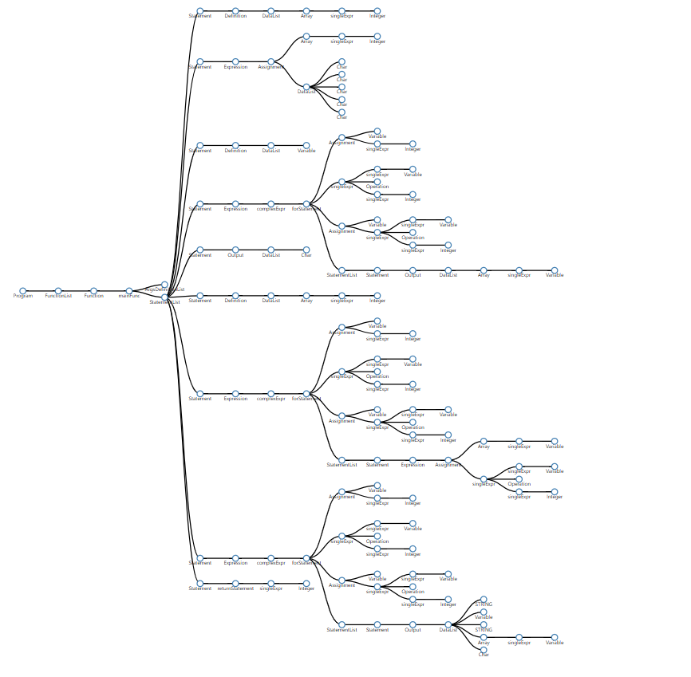


## 4. 语义分析

### 4.1 LLVM概述

LLVM (Low Level Virtual Machine) 项目是模块化和可重用的编译器和工具链技术的集合。 

LLVM 是 Illinois 大学发起的一个开源项目，提供了一套中立的中间代码和编译基础设施，并围绕这些设施提供了一套全新的编译策略，用于优化任意程序语言编写的程序的编译时间（compile-time）、链接时间（link-time）、运行时间（run-time）以及空闲时间（idle-time）。

LLVM 可以提供完整的编译器系统的中间层，使用通用的代码表示形式（IR），从编译器获取中间表示（IR）代码并发出优化的 IR。然后可以将此新的IR转换并链接到目标平台的依赖于机器的汇编语言代码。LLVM 可以接受来自 GNU 编译器集合（GCC）工具链的 IR，允许它与为该项目编写的大量现存编译器一起使用。LLVM 还可以在运行时、在编译时、链接时、甚至二进制机器代码生成可重定位的机器代码。所有 LLVM 可以为任何编程语言独立编写前端，并且可以为任意硬件架构独立编写后端。

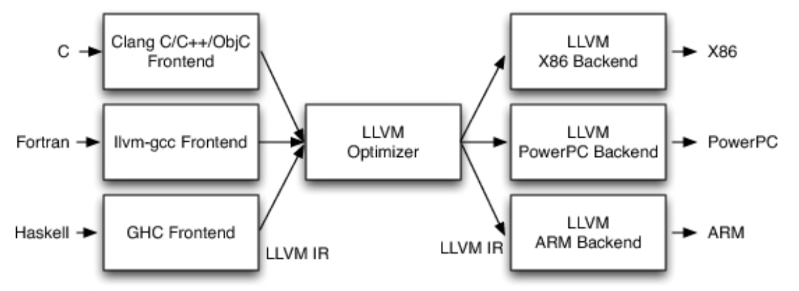

LLVM支持独立于语言的指令集和类型系统。每个指令都是静态单一分配形式（SSA），这意味着每个变量（称为类型化寄存器）被分配一次然后被冻结。这有助于简化变量之间依赖关系的分析。LLVM 允许代码按照传统的 GCC 系统进行静态编译，也可以通过与 Java 类似的即时编译从 IR 到机器代码进行后期编译。类型系统由基本类型（如整数或浮点数）和五个派生类型组成：指针，数组，向量，结构和函数。可以通过在 LLVM 中组合这些基本类型来表示具体语言的类型构造。例如，C++中的类可以通过结构、函数和函数指针数组的混合来表示。

### 4.2 LLVM IR

LLVM 的核心是 IR（Intermediate Representation），IR 是连接编译器前端与 LLVM 后端的一个桥梁。LLVM IR 是一个低级的类似于 RISC 的虚拟指令集。

在基于 LLVM 的编译器中，前端负责解析、验证和诊断输入代码中的错误，然后将解析的代码转换为 LLVM IR（通常通过构建 AST，然后将 AST 转换为 LLVM IR）。该 IR 可以选择性地通过一系列分析和优化通道来改进代码，然后被发送到代码生成器以生成本地机器代码。


#### 4.2.1 IR表示形式

它的表示形式被设计为三种不同的格式：

- 表示为内存中编译器中间语言，如BasicBlock，Instruction这种cpp类
- 表示为在磁盘上的位码（适合于即时编译器的快速加载），不可读的二进制文件，磁盘文件后缀为.bc
- 表示为人类可读的汇编语言，磁盘文件后缀为.ll

#### 4.2.2 IR 布局

每个IR文件称为一个Module，LLVM 程序由 Modules 组成，每个程序模块都是输入程序的翻译单元。每个模块由函数，全局变量和符号表条目组成。函数由参数和多个基本块组成，其中第一个基本块称为entry基本块，这是函数开始执行的起点，另外 LLVM 的函数拥有独立的符号表，可以对标识符进行查询和搜索。每一个基本块包含了标签和各种指令的集合，标签作为指令的索引用于实现指令间的跳转，指令包含Phi指令、一般指令以及终止指令等。模块可以与 LLVM 链接器组合在一起，LLVM 链接器合并函数（和全局变量）定义，解析前向声明，并合并符号表条目。

#### 4.2.3 内存中的 IR 模型

- Module 类

  Module 可以理解为一个完整的编译单元。一般来说，这个编译单元就是一个源码文件，如一个后缀为 cpp 的源文件。

- Function 类

  这个类顾名思义就是对应于一个函数单元。Function 可以描述两种情况，分别是函数定义和函数声明。

- BasicBlock 类

  这个类表示一个基本代码块，基本代码块是一段没有控制流逻辑的基本流程，相当于程序流程图中的基本过程（矩形表示）。

- Instruction 类

  指令类是 LLVM 中定义的基本操作，比如加减乘除这种算数指令、函数调用指令、跳转指令、返回指令等。

#### 4.2.3 IR 核心类

- Value 类

  Value 是一个非常基础的基类。Value 是用于表示 LLVM 中的“ 静态单一分配（SSA）寄存器”或“ SSA 值”的类。SSA 值的最独特之处在于它们的值是在相关指令执行时计算的，并且在指令重新执行之前它不会获得新值。换句话说，没有办法“改变”SSA值。

- User 类

  一个继承于 User 的类表示它会使用一个或多个 Value 对象。

- Type 类

  Type 类内包含了 LLVM IR 的所有内置类型。LLVM 类型系统是中间表示的最重要的特征之一。类型化使得可以直接对中间表示执行许多优化，而不必在转换之前在侧面进行额外的分析。强大的类型系统使读取生成的代码变得更加容易，并且支持新的分析和转换。以下是不同 Type 的 Type ID。

  ```c++
    enum TypeID {
      // PrimitiveTypes - make sure LastPrimitiveTyID stays up to date.
      VoidTyID = 0,    ///<  0: type with no size
      HalfTyID,        ///<  1: 16-bit floating point type
      FloatTyID,       ///<  2: 32-bit floating point type
      DoubleTyID,      ///<  3: 64-bit floating point type
      X86_FP80TyID,    ///<  4: 80-bit floating point type (X87)
      FP128TyID,       ///<  5: 128-bit floating point type (112-bit mantissa)
      PPC_FP128TyID,   ///<  6: 128-bit floating point type (two 64-bits, PowerPC)
      LabelTyID,       ///<  7: Labels
      MetadataTyID,    ///<  8: Metadata
      X86_MMXTyID,     ///<  9: MMX vectors (64 bits, X86 specific)
      TokenTyID,       ///< 10: Tokens
  
      // Derived types... see DerivedTypes.h file.
      // Make sure FirstDerivedTyID stays up to date!
      IntegerTyID,     ///< 11: Arbitrary bit width integers
      FunctionTyID,    ///< 12: Functions
      StructTyID,      ///< 13: Structures
      ArrayTyID,       ///< 14: Arrays
      PointerTyID,     ///< 15: Pointers
      VectorTyID       ///< 16: SIMD 'packed' format, or other vector type
    };
  ```

- Constant 类

  Constant 类表示一个各种常量的基类，基于它派生出了 ConstantInt 整型常量，ConstantFP 浮点型常量，ConstantArray 数组常量，ConstantStruct 结构体常量。


### 4.3 IR生成

#### 4.3.1 运行环境设计

LLVM IR的生成依赖上下文环境，我们构造了`CodeGenerator`类来保存环境，在递归遍历`AST`节点时传递`CodeGenerator`的`Instance`来生成每个节点的IR。`CodeGenerator`的环境配置具体如下：

- 静态全局的上下文变量和构造器变量

  ```c++
  static llvm::LLVMContext TheContext;
  static llvm::IRBuilder<> TheBuilder(TheContext);
  ```

- 公有的模块示例、函数栈、结构体表

  - 模块实例是中间代码顶级容器，用于包含所有变量、函数和指令

    ```c++
    std::unique_ptr<llvm::Module> TheModule;
    ```

  - 函数栈用于存储函数指针的栈，用于实现静态链（函数递归调用）和动态链（变量访问）

    ```c++
    std::vector<llvm::Function*> funcStack;
    ```

  - 结构体表存储了结构体的名字与类型的对应关系、结构体的名字与结构体对象的对应关系以及结构体名字的id，便于实现结构体的定义、赋值和调用。

    ```c++
    std::map<std::string, llvm::StructType *> TypeMap;
    std::map<std::string, _Struct *> StructMap;
    std::map<std::string, std::string> VarStructID;
    ```

- 符号表

  LLVM的`llvm::Function*`自带符号表，创建变量`createAlloca`时可以自动插入函数的符号表，查询变量可以通过`getValueSymbolTable()->lookup(name)`。

  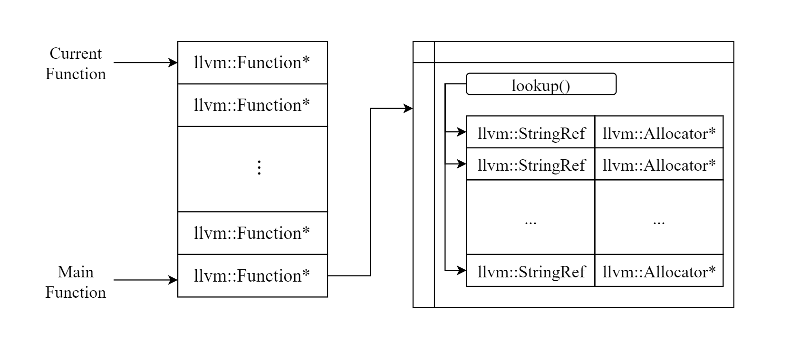

  结合我们所用的函数栈，可以在函数中查找符号相应的地址（即`createAlloca`时分配的`allocator`）。如果没有找到该符号，说明该符号没有定义过，抛出错误异常。

  ```c++
  llvm::Value* CodeGenerator::getValue(const std::string & name){
      llvm::Value * result = nullptr;
      try{
          for (llvm::Function * it : funcStack){
              if ((result = it->getValueSymbolTable()->lookup(name)) != nullptr){
                  std::cout << "Find " << name << std::endl;
                  return result;
              }
          }   
          throw(name);
      }
      catch(const std::string msg){
          std::cout << "error: '" << msg << "' is not declared. " << std::endl;
      }
      assert(result != nullptr);
  }
  ```

- 系统函数：mainFunction、scanFunction、printFunction

  系统函数在整个运行环境初始化时创建，在代码开始时就作为系统的全局函数进行，所有函数，可以方便在运行环境的任何时候调用。

  - mainFunc：程序的主函数，在`_mainFunction`类的`codeGen`中初始化，一个运行环境只有一个主函数。

  - scanFunction：输入函数，调用C的系统函数进行。在初始化运行环境时就创建，以方便整个运行环境进行调用。

    ```c++
    // create scan function
    llvm::FunctionType* scanType = llvm::FunctionType::get(TheBuilder.getInt32Ty(), true);
    llvm::Function* scanFunc = llvm::Function::Create(scanType, llvm::Function::ExternalLinkage, llvm::Twine("scanf"), TheModule.get());
    scanFunc->setCallingConv(llvm::CallingConv::C);    
    this->scanFunction = scanFunc;
    ```

  - printFunction：输出函数，调用C的系统函数进行，需要放入参数。

    ```c++
    // create print function
    std::vector<llvm::Type*> argsType;
    argsType.push_back(TheBuilder.getInt8PtrTy());
    llvm::FunctionType* printType = llvm::FunctionType::get(TheBuilder.getInt32Ty(), llvm::makeArrayRef(argsType), true);
    llvm::Function* printFunc = llvm::Function::Create(printType, llvm::Function::ExternalLinkage, llvm::Twine("printf"), TheModule.get());
    printFunc->setCallingConv(llvm::CallingConv::C);
    this->printFunction = printFunc;
    ```

    

#### 4.3.2 类型转换

在我们设计的语言中，有如下类型：

- C_INTEGER：整数类型
- C_REAL：double浮点数类型
- C_CHAR：char字符类型
- C_BOOLEAN：bool类型

在LLVM的操作中，需要将上述类型转换为相对应的LLVM类型，便于进行变量的定义和赋值等操作。

```c++
llvm::Type *llvmType(const BuildInType & type){
    switch(type){
        case C_INTEGER:{
            return llvm::Type::getInt32Ty(TheContext);
        }
        case C_REAL:{
            return llvm::Type::getDoubleTy(TheContext);
        }
        case C_BOOLEAN:{
            return llvm::Type::getInt1Ty(TheContext);
        }
        case C_CHAR:{
            return llvm::Type::getInt8Ty(TheContext);
        }
    }
}
```


#### 4.3.3 代码入口

代码入口用 `_Program` 类进行处理。` _Program`类的意义是程序，包括 `_FunctionList` 和 `_StructList` 类的指针对象成员变量。`_Program` 会将读到的所有函数保存在自己的 `myFuncs `链表中，分别调用这些函数的 `codeGen` 方法。前端在读到结构体定义时，会把所有结构体依次作为 `_Struct` 类保存在` _Program` 的 `myStructs` 链表中。在 `_Program` 类的 `codeGen`  方法中，会将 `myStructs` 链表中的 `_Struct` 依次创建 `llvm::StructType` 并保存在 `generator` 的 `TypeMap` 中，实现结构体类型名字和 `llvm::StructType` 的 map 对应。

```c++
llvm::Value *_Program::codeGen(CodeGenerator & generator){
    Debug("_Program::codeGen");
    if(this->hasStruct())
    {
        for(auto stu :*this->myStructs){
            std::string name=*stu->struct_ID;
            generator.StructMap[name]=stu;
            llvm::StructType *structType = generator.TheModule->getTypeByName(name);//获取当前module中名为Number的结构体
            if (!structType) {
                    //如果当前module中没有，就创建一个
                structType = llvm::StructType::create(TheContext, name);
                std::vector<llvm::Type*> elements;	//添加结构体元素
                for (auto defvar : *stu->defins){
                    llvm::Type* defType;
                    if(defvar->isStruct){
                        defType=generator.TypeMap[defvar->getStructID()];
                    }
                    else{
                        defType = llvmType(defvar->def_Type);
                    }
                    for (auto elemvar : *defvar->data){
                        llvm::Type* type;
                        _Variable * elemvariable = dynamic_cast<_Variable*>(elemvar);
                        if(elemvariable->v_Type == _Variable::ARRAY){
                            llvm::Value *size = elemvariable->exprID->codeGen(generator);
                            llvm::ConstantInt *sizeInt = llvm::dyn_cast<llvm::ConstantInt>(size);                       
                            type = llvm::ArrayType::get(defType, sizeInt->getZExtValue());
                        }
                        else{
                            type=defType;
                        }
                        elements.push_back(type);
                    }
                }
                structType->setBody(elements);
                generator.TypeMap[name]=structType;
            }
            
        }
    }
    for (auto func : *this->myFuncs){
        std::cout << "hello" << std::endl;
        func->codeGen(generator);
    }
}
```


#### 4.3.4 变量定义

每一条定义语句都会创建一个 `_Definition` 类的实例。 `_Definition`  通过 `def_Type` 成员变量记录定义式左边的类型名，`isStruct` 表示当前类型是否是结构体，如果是结构体，`structID`  变量将额外记录结构体类型名，`data` 以链表形式保存定义式右边的变量语句。从`data` 中遍历所有 `_Variable` 变量，分别进行定义操作。在遍历变量前，通过 `defType = llvmType(this->def_Type);` 将 `def_Type` 成员变量转换为内置类型。

##### 1. 单一变量

对于单一变量，仅需调用 `createDefAlloca`方法，传入 `defType` 和自己的变量名即可。

```c++
auto alloc = createDefAlloca(generator.getCurFunc(), *variable->ID_Name, defType);
```

##### 2. 数组变量

对于数组变量，不能简单传入 `defType` ，需要根据数组的大小生成相应的 `llvm::ArrayType` 。

```c++
llvm::Value *size = variable->exprID->codeGen(generator);
llvm::ConstantInt *sizeInt = llvm::dyn_cast<llvm::ConstantInt>(size);          
llvm::Type *arrayType = llvm::ArrayType::get(defType, sizeInt->getZExtValue());
auto alloc = createDefAlloca(generator.getCurFunc(), *variable->ID_Name, arrayType);
```

##### 3. 结构体变量

对于结构体变量，要通过 `TypeMap`获取 `defType`。其它操作按照单一变量与数组变量分别进行。

```c++
defType=generator.TypeMap[this->getStructID()];
```


#### 4.3.5 赋值语句

#### 4.3.5 赋值语句

每一条定义语句都会创建一个 `_assignExpression` 类的实例。 根据 `v_Type` 判断赋值语句的类型是单一赋值、函数赋值还是数组赋值。成员变量 `val` 是 `_Variable` 类型的指针，保存了左式的变量类型和变量名。

##### 1. 单一赋值

先获取赋值语句的右式，得到 `codeGen` 的结果。接下来根据 `val` 的类型分类。

- 单一类型

  左式也是单一变量。直接根据变量名得到存储地址，进行赋值。

- 数组元素

  获取数组元素地址，再进行赋值。

- 结构体的成员变量

​		获取结构体成员变量的地址，再进行赋值。

- 结构体成员变量的数组元素

  先获取结构体成员的地址，再把它当作数组地址获取对应数组元素的地址，再进行赋值。

- 结构体数组元素的成员变量

​		先获取结构体数组元素的地址，再计算成员变量的地址，最后赋值。

##### 2. 数组赋值

实现数组的花括号赋值。

##### 3. 函数赋值

赋值语句的右式是函数体，需要调用函数的 `codeGen` 方法。


#### 4.3.6 运算符操作

`LLVM`的`IRBuilder`提供了二元操作的接口，支持add, sub, mul, div, and, or, xor, cmp等操作。首先得到两个操作数

```c++
// get the values
llvm::Value *lhsVal = lhs->codeGen(generator);
llvm::Value *rhsVal = rhs->codeGen(generator);
```

之后在运算之前，需要判断两个操作数的类型，如果有其中一个为浮点数，则将两个操作数类型都转换为浮点数。

```c++
bool lhsDouble, rhsDouble, isDouble;
lhsDouble = lhsVal->getType()->isDoubleTy();
rhsDouble = rhsVal->getType()->isDoubleTy();
isDouble = lhsDouble || rhsDouble;
if(isDouble){
    lhsVal = TheBuilder.CreateSIToFP(lhsVal, llvm::Type::getDoubleTy(TheContext));
    rhsVal = TheBuilder.CreateSIToFP(rhsVal, llvm::Type::getDoubleTy(TheContext));
}
```

运算时，根据运算符和操作数类型，调用`IRBuilder`的相应函数即可。

如：

```c++
switch(this->OP){
    case C_ADD:{
        if(isDouble){
            return TheBuilder.CreateFAdd(lhsVal, rhsVal, "addtmpf");
        }
        else{
            return TheBuilder.CreateAdd(lhsVal, rhsVal, "addtmpi");
        }
    }
        ...
}
```

具体操作符、类型及其对应函数如下：

| 操作符 | 浮点型        | 整型          |
| ------ | ------------- | ------------- |
| C_ADD  | CreateFAdd    | CreateAdd     |
| C_SUB  | CreateFSub    | CreateSub     |
| C_MUL  | CreateFMul    | CreateMul     |
| C_DIV  | CreateFDiv    | CreateSDiv    |
| C_GE   | CreateFCmpOGE | CreateICmpSGE |
| C_GT   | CreateFCmpOGT | CreateICmpSGT |
| C_LT   | CreateFCmpOLT | CreateICmpSLT |
| C_LE   | CreateFCmpOLE | CreateICmpSLE |
| C_EQ   | CreateFCmpOEQ | CreateICmpEQ  |
| C_NE   | CreateFCmpONE | CreateICmpNE  |
| C_OR   | TYPE ERROR    | CreateOr      |
| C_MOD  | CreateFRem    | CreateSRem    |
| C_AND  | TYPE ERROR    | CreateAnd     |
| C_XOR  | TYPE ERROR    | CreateXor     |


#### 4.3.7 分支语句

分支语句为`if-else`语句，由`_ifStatement`和`_elsePart`类的`codeGen`实现。分别递归调用`if`和`else`里面的语句，格式为：

```c++
if(cond){
    ifblock
}
else{
    elsepart
}
```

分支语句`if`可以分为三个基本块：

- then：条件为真执行的块，结束之后跳转到`ifend`块

- else：条件为假执行的块，结束之后跳转到`ifend`块

- ifend：`if`语句结束之后的基础块，作为后面代码的插入点。

  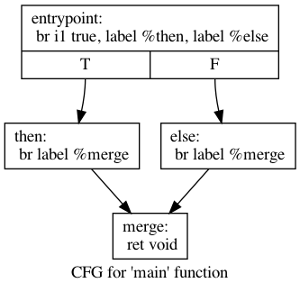

```c++
llvm::BasicBlock *thenBlock = llvm::BasicBlock::Create(TheContext, "then", TheFunction);
llvm::BasicBlock *elseBlock = llvm::BasicBlock::Create(TheContext, "else", TheFunction);
llvm::BasicBlock *endBlock = llvm::BasicBlock::Create(TheContext, "ifend", TheFunction);
```

在执行时，需要判断条件是否满足，并创建判断条件基本块。

```c++
llvm::Value *condValue = this->condition->codeGen(generator);
condValue = TheBuilder.CreateICmpNE(condValue, llvm::ConstantInt::get(llvm::Type::getInt1Ty(TheContext), 0, true), "ifCond");
TheBuilder.CreateCondBr(condValue, thenBlock, elseBlock);
```

之后在各个基本块中遍历执行该块中的相关语句，并调用`GetInsertBlock`插入块。

```c++
// Then
TheBuilder.SetInsertPoint(thenBlock);
for (auto & statement : *this->statements){
    statement->codeGen(generator);
}
TheBuilder.CreateBr(endBlock);
thenBlock = TheBuilder.GetInsertBlock();

// Else
TheBuilder.SetInsertPoint(elseBlock);
this->elsePart->codeGen(generator);
TheBuilder.CreateBr(endBlock);
elseBlock = TheBuilder.GetInsertBlock();

// endblock
TheBuilder.SetInsertPoint(endBlock);
```

其中，`if-else`语句中的`else`还分成了三种情况：

- NONE：`else`语句为空
- ELSE：有`else`语句
- ELSE-IF：`else if`语句

```c++
llvm::Value *_elsePart::codeGen(CodeGenerator & generator){
    Debug("_elseStatement::codeGen");
    llvm::Value *value = nullptr;
    switch(this->v_Type){
        case NONE:{
            return value;
        }
        case ELSE:{
            for (auto & statement : *this->v_Else.statements){
                value = statement->codeGen(generator);
            }
            return value;
        }
        case ELSEIF:{
            return this->v_Else.ifBody->codeGen(generator);
        }
    }
}
```

执行到`endBlock`之后，分支语句完成。


#### 4.3.8 循环语句

##### 1. for语句

for语句由`_forStatement`类的`codeGen`实现，表达式为：

```c++
for(start; cond; update){
    loopBlock
}
```

for循环可以分为三个基本块：

- condBlock：判断循环条件
- endBlock：循环结束的基本块，为循环语句下面语句的入口
- loopBlock：循环体的基本块，递归执行循环体内部语句

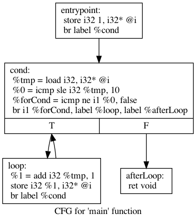

```c++
llvm::BasicBlock *condBlock = llvm::BasicBlock::Create(TheContext, "forcond", TheFunction);
llvm::BasicBlock *endBlock = llvm::BasicBlock::Create(TheContext, "forend", TheFunction);
llvm::BasicBlock *loopBlock = llvm::BasicBlock::Create(TheContext, "forbody", TheFunction);
TheBuilder.CreateBr(condBlock);
```

创建基本块后，首先判断是否符合循环条件：

```c++
llvm::Value *condValue = this->condExpr->codeGen(generator);
auto block = TheBuilder.CreateCondBr(condValue, loopBlock, endBlock);
```

之后执行循环体内部的语句。

```c++
// basic block for body
TheBuilder.SetInsertPoint(loopBlock);
for (auto & stmt : *this->statements){
    stmt->codeGen(generator);
}
```

执行结束后，需要更新`for`的末尾表达式，并判断跳转到判断循环条件的基本块，如果符合条件则继续执行循环，否则结束循环执行到`endBlock`。

```c++
// step
// assignment should return the updated value
llvm::Value *updateVal = this->stepExpr->codeGen(generator);
TheBuilder.CreateBr(condBlock);
loopBlock = TheBuilder.GetInsertBlock();
```


##### 2. while语句

while语句由`_whileStatement`的`codeGen`实现，格式为：

```c++
while(cond){
    loopBlock
}
```

与`for`语句类似，while循环也可以分为三个基本块：

- condBlock：判断循环条件
- endBlock：循环结束的基本块，为循环语句下面语句的入口
- loopBlock：循环体的基本块，递归执行循环体内部语句


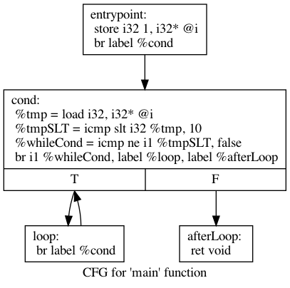

创建基本块时，首先需要获得当前语句所在的函数体，然后在该函数体内部创建基本块。

```c++
llvm::Function *TheFunction = generator.getCurFunc();
llvm::BasicBlock *condBlock = llvm::BasicBlock::Create(TheContext, "cond", TheFunction);
llvm::BasicBlock *loopBlock = llvm::BasicBlock::Create(TheContext, "loop", TheFunction);
llvm::BasicBlock *endBlock = llvm::BasicBlock::Create(TheContext, "loopend", TheFunction);
```

之后也是分别插入各个基本块，并递归执行循环体内部语句。不同于for语句的是，while语句没有末尾表达式，也就是没有更新值的步骤，只需要执行循环体内部语句后，判断是否满足循环条件即可。

```c++
// condtion block
TheBuilder.CreateBr(condBlock);
TheBuilder.SetInsertPoint(condBlock);
llvm::Value *condValue = this->condition->codeGen(generator);
auto branch = TheBuilder.CreateCondBr(condValue, loopBlock, endBlock);
condBlock = TheBuilder.GetInsertBlock();

// loop block
TheBuilder.SetInsertPoint(loopBlock);
for (auto statement : *this->statements){
    statement->codeGen(generator);
}
TheBuilder.CreateBr(condBlock);

// end block
TheBuilder.SetInsertPoint(endBlock);
return branch;
```


#### 4.3.9 函数体声明

##### 1. 主函数

主函数为`CodeGenerator`类中的成员函数`mainFunction`，由`_mainFunction`类的`codeGen`实现。

创建主函数时，首先创建参数的`vector`。由于主函数没有参数，因此该`vector`没有进行赋值。主函数的类型为`int `类型，由于在后面的生成可执行文件需要用到该主函数的链接，因此需要将该主函数的链接设置为`ExternalLinkage`方便外部函数调用，并设置函数名为`Main`。

```c++
vector<llvm::Type*> argTypes;
llvm::FunctionType *funcType = llvm::FunctionType::get(TheBuilder.getInt32Ty(), argTypes, false);
generator.mainFunction = llvm::Function::Create(funcType, llvm::GlobalValue::ExternalLinkage, "Main", generator.TheModule.get());
```

创建函数类型后，创建该函数的基本块，将该函数放入`CodeGenerator`实例中的函数栈中，以便后面进行函数的查找，并插入基本块。之后递归执行函数中的语句即可。

```c++
llvm::BasicBlock *basicBlock = llvm::BasicBlock::Create(TheContext, "entry", generator.mainFunction, 0);
generator.pushFunc(generator.mainFunction);
TheBuilder.SetInsertPoint(basicBlock);

for (auto & statement : *this->statements){
    statement->codeGen(generator);
}
//Pop back
generator.popFunc();
```


##### 2. 其他函数

其他函数为除了`main`函数之外的自定义函数，由`_Subroutine`类的`codeGen`实现。首先需要获取该函数的返回类型，具体对应关系如下：

| string  | BuildIntype | LLVMType    |
| ------- | ----------- | ----------- |
| int     | C_INTEGER   | getInt32Ty  |
| char    | C_CHAR      | getInt8Ty   |
| double  | C_REAL      | getDoubleTy |
| boolean | C_BOOLEAN   | getInt1Ty   |
| void    | C_VOID      | getVoidTy   |

之后需要将各个参数的类型放入`vector`中。需要注意的是，如果参数为数组指针类型，需要创建相应的指针类型。

```c++
vector<llvm::Type *> argsType;
for (auto & arg : *this->args){
    if (arg->args->v_Type == _Variable::ArrayPtr){
        switch(arg->arg_Type){
            case C_INTEGER:
                argsType.push_back(llvm::Type::getInt32PtrTy(TheContext));
                break;
            case C_CHAR:
                argsType.push_back(llvm::Type::getInt8PtrTy(TheContext));
                break;
        }
    }
    else{
        argsType.push_back(llvmType(arg->arg_Type));
    }
}
```

与主函数类似，获取返回类型和参数类型后，即可设置函数指针、函数基本块，并将函数放入函数栈中。需要注意的是，这里的函数值不需要外部调用，因此设置`InternalLinkage`即可。

```c++
llvm::FunctionType *funcType = llvm::FunctionType::get(llvmType(retType), argsType, false);
llvm::Function *function = llvm::Function::Create(funcType, llvm::GlobalValue::InternalLinkage, *this->Func_Id, generator.TheModule.get());
generator.pushFunc(function);

// create a basic block
llvm::BasicBlock *basicBlock = llvm::BasicBlock::Create(TheContext, "entry", function);
TheBuilder.SetInsertPoint(basicBlock);
```

在进入函数前，需要为相应参数分配空间，并存储到函数的参数迭代子中，以便参数在函数体语句中使用。

```c++
// create a function argument iterator
llvm::Function::arg_iterator argIter = function->arg_begin();
vector<llvm::Type*>::iterator argsTypeIter = argsType.begin();
for (auto & arg : *this->args){
    llvm::AllocaInst *alloc = createDefAlloca(function, *arg->args->ID_Name, *argsTypeIter++);
    TheBuilder.CreateStore(argIter++, alloc);
}
```

进入函数体后，对函数体内部的语句递归执行即可。

```c++
//Sub routine
for (auto & stmt : *this->statements){
    stmt->codeGen(generator);
}
```

对于非`void`的函数，函数体内部已经有`return `语句，在`statements`中已经递归调用.

```c++
llvm::Value *_returnStatement::codeGen(CodeGenerator & generator){
    Debug("_returnStatement::codeGen");
    llvm::Value *retVal = this->expr->codeGen(generator);
    TheBuilder.CreateRet(retVal);
    return retVal;
}
```

对于没有返回值的`void`类型函数，由于在函数体内部没有`return`语句，因此需要手动创建`return`语句。

```c++
if (retType == C_VOID){
    TheBuilder.CreateRetVoid();
}
```

最后将函数弹出栈，以确保运行环境的正确性。

```c++
//Pop back
generator.popFunc();
```


#### 4.3.10 函数调用

函数调用由`_functionCall`类的`codeGen`函数实现。在函数定义时，函数名都被存在了`generator`示例的`TheModule`模块中，可以通过调用`getFunction`函数来得到该函数指针：

```c++
llvm::Function *function = generator.TheModule->getFunction(*this->func_Name);
```

得到函数指针后，将函数参数放入`vector`中，然后调用`LLVm`中`IRBuilder`的`CreateCall`进行函数的调用。

```c++
std::vector<llvm::Value *> funcArgs;
if (this->args){
    for (auto & arg : *this->args){
        funcArgs.push_back(arg->codeGen(generator));
    }
}
llvm::Value * ret = TheBuilder.CreateCall(function, funcArgs, "call");
return ret;
```


#### 4.3.11 输入

输入由`_Input`类的`codeGen`实现。输入调用的是`C`语言的输入函数，C语言的输入函数为`scanf("%d", &addr)`，因此需要获得输入参数的地址和类型。类型对应如下：

| 类型   | llvm类型     | 格式字符串 |
| ------ | ------------ | ---------- |
| int    | getInt8Ty()  | %d         |
| char   | getInt32Ty() | %c         |
| double | getDouble()  | %lf        |
| bool   | getInt1Ty()  | %d         |

```c++
string format = "";
vector<llvm::Value*> params;
for (auto & var : *this->vars){
    llvm::Value *varValue = var->codeGen(generator);
    llvm::Type *varType = varValue->getType();
    llvm::Value *varAddr = generator.getValue(dynamic_cast<_Variable*>(var)->ID_Name->c_str());
    if(varType == TheBuilder.getInt8Ty()){
        format += "%c";
    }
    else if(varType == TheBuilder.getInt32Ty()){
        format += "%d";
    }
    else if(varType == TheBuilder.getDoubleTy()){
        format += "%lf";
    }
    else if(varType == TheBuilder.getInt8Ty()){
        format += "%d";
    }
    params.push_back(varAddr);
}
```

参数的地址可以通过`generator`的`getValue`函数获得（在`createAlloca`时会将参数的地址存入符号表中，`getValue`函数实现了在符号表中查找相应的地址），而参数类型可以通`getType()`函数获得。将参数的地址和格式化字符串配对后插入参数的`vector`中，调用运行环境中的`scanFunction`即可调用输入函数。

```c++
params.insert(params.begin(), TheBuilder.CreateGlobalStringPtr(format));
TheBuilder.CreateCall(generator.scanFunction, params, "scanf");
```


#### 4.3.12 输出

输出由`_Output`类的`codeGen`实现。输出调用的是`C`语言的输出函数，C语言的输函数为`printf("%d", param)`，因此需要获得输入参数名和类型。类型对应与输入函数相同，不同的是在输出时，有时需要进行格式化输出。例如想要输出宽度为`10`的整数，C语言的函数为`printf("%10d", param)`，因此需要获得输出数的宽度。在`_Output`类中有`setD`变量和`digit`变量，`setD`代表是否进行格式化输出，`digit`为输出的位数。

```c++
string format = "";
vector<llvm::Value*> params;
bool isString;
llvm::Value * varValue;
llvm::Value * strValue;
for (auto & var : *this->vars){
    varValue = var->codeGen(generator);
    llvm::Type *varType = varValue->getType();
    if(varType == TheBuilder.getInt8Ty()){
        format += "%c";
    }
    else if(varType == TheBuilder.getInt32Ty()){
        if (setD){
            string c = std::to_string(digit);
            format += "%" + c + "d";
        }
        else{
            format += "%d";
        }
    }
    else if(varType == TheBuilder.getDoubleTy()){
        format += "%.1f";
    }
    else if(varType == TheBuilder.getInt8Ty()){
        format += "%d";
    }
    else{
        format += "%s";
    }
    params.push_back(varValue);
}
```

此外，输出支持输出字符串，输出字符串的格式为`printf("%s", string)`。完成格式化字符串和参数的匹配后，调用输出函数`generator.printFunction`即可。

```c++
params.insert(params.begin(), TheBuilder.CreateGlobalStringPtr(format));
TheBuilder.CreateCall(generator.printFunction, llvm::makeArrayRef(params), "printf");
```


## 5. 代码生成

### 5.1 选择目标机器

LLVM 支持本地交叉编译。我们可以将代码编译为当前计算机的体系结构，也可以像针对其他体系结构
一样轻松地进行编译。LLVM 提供了 `sys::getDefaultTargetTriple` ，它返回当前计算机的目标三元
组：

```c++
auto TargetTriple = sys::getDefaultTargetTriple();
```

在获取Target前，初始化所有目标以发出目标代码：

```c++
InitializeAllTargetInfos();
InitializeAllTargets();
InitializeAllTargetMCs();
InitializeAllAsmParsers();
InitializeAllAsmPrinters();
```

使用目标三元组获得 Target：

```c++
std::string Error;
auto Target = TargetRegistry::lookupTarget(TargetTriple, Error);
// Print an error and exit if we couldn't find the requested target.
// This generally occurs if we've forgotten to initialise the
// TargetRegistry or we have a bogus target triple.
if (!Target) {
    errs() << Error;
    return 1;
}
```

`TargetMachine` 类提供了我们要定位的机器的完整机器描述：

```c++
auto CPU = "generic";
auto Features = "";
TargetOptions opt;
auto RM = Optional<Reloc::Model>();
auto TargetMachine = Target->createTargetMachine(TargetTriple, CPU, Features,
opt, RM);
```

### 5.2 配置 Module

配置模块，以指定目标和数据布局，可以方便了解目标和数据布局。

```c++
generator.TheModule->setDataLayout(TargetMachine->createDataLayout());
generator.TheModule->setTargetTriple(TargetTriple);
```

### 5.3 生成目标代码

1. 先定义要将文件写入的位置

```c++
auto Filename = "output.o";
std::error_code EC;
raw_fd_ostream dest(Filename, EC, sys::fs::OF_None);
if (EC) {
    errs() << "Could not open file: " << EC.message();
    return 1;
}
```

2.定义一个发出目标代码的过程，然后运行该 pass

```c++
legacy::PassManager pass;
auto FileType = TargetMachine::CGFT_ObjectFile;
if (TargetMachine->addPassesToEmitFile(pass, dest, nullptr, FileType)) {
    errs() << "TargetMachine can't emit a file of this type";
    return 1;
}
pass.run(*generator.TheModule);
dest.flush();
```

更简便的方法是使用LLVM自带的工具套件：llvm-as和llc

- llvm-as可以将生成的IR文件编译为以.bc为后缀的字节码
- llc可以将字节码编译成以.s为后缀的汇编代码

```c++
llvm-as spl.ll -o spl.bc
llc -march=x86_64 spl.bc -o spl.s
```

### 

## 6. 代码测试

### 6.1 测试说明

测试时，首先`make`编译出`./compiler`文件，然后将编写的代码作为文件输入生成中间代码。然后用`objtest.cpp`文件链接生成可执行文件

```bash
make
./compiler < ./test.cmm
./run.sh
```

run.sh文件：

```bash
clang++ objtest.cpp output.o -o objtest
./objtest
```


### 6.2 基本测试

#### 6.2.1 常规语句

测试常规语句，包括：

- 变量定义及赋值：int a, b, c; a = 1;
- 二元运算：四则运算和逻辑运算等
- 循环：for，while
- 条件分支：if，else，else if
- 输入：cin >> param
- 输出（及格式化输出）：cout << setw(10) << param << endl;

编写测试代码如下：

```c++
int main(){
    int a;
    a = 1;
    char b;
    b = 'b';
    int i, n;
    cout << "Input a number n: ";
    cin >> n;
    for(i = 0; i < n; i = i + 1){
        if (i < n/2){
            cout << "less than half: " << i << endl;
        }
        else if(i == n/2){
            cout << "i is half, print b: " << b << endl;
        }
        else {
            cout << "greater than half: " << i << endl;
        }
    }
    cout << "reverse of n: " << endl;
    while(i > 0){
        cout << setw(5) << i << endl;
        a = a * i;
        i = i - 1;
    }
    cout << "fact n:" << a << endl;
    return 0;
}
```

执行文件，生成的中间代码如下：

- 函数主体：

  ```llvm
  ; ModuleID = 'main'
  source_filename = "main"
  
  @0 = private unnamed_addr constant [19 x i8] c"Input a number n: \00"
  @1 = private unnamed_addr constant [3 x i8] c"%s\00"
  ...
  (省略其余输出常量)
  
  declare i32 @printf(i8*, ...)
  
  declare i32 @scanf(...)
  
  define i32 @Main() {
  entry:
    %n = alloca i32
    %i = alloca i32
    %b = alloca i8
    %a = alloca i32
    store i32 1, i32* %a
    store i8 98, i8* %b
    %printf = call i32 (i8*, ...) @printf(i8* getelementptr inbounds ([3 x i8], [3 x i8]* @1, i32 0, i32 0), i8* getelementptr inbounds ([19 x i8], [19 x i8]* @0, i32 0, i32 0))
    %0 = load i32, i32* %n
    %scanf = call i32 (...) @scanf(i8* getelementptr inbounds ([3 x i8], [3 x i8]* @2, i32 0, i32 0), i32* %n)
    ...
    ret i32 0
  }
  ```

- for循环：

  for循环生成了forbody（循环体）、forcond（条件判断）、forend（循环结束）三个基本块

  ```llvm
    store i32 0, i32* %i
    br label %forcond
  
  forcond:                                          ; preds = %ifend, %entry
    %1 = load i32, i32* %i
    %2 = load i32, i32* %n
    %cmptmpi = icmp slt i32 %1, %2
    br i1 %cmptmpi, label %forbody, label %forend
  
  forend:                                           ; preds = %forcond
    %printf11 = call i32 (i8*, ...) @printf(i8* getelementptr inbounds ([5 x i8], [5 x i8]* @10, i32 0, i32 0), i8* getelementptr inbounds ([15 x i8], [15 x i8]* @9, i32 0, i32 0), i8 10)
    br label %cond
  
  forbody:                                          ; preds = %forcond
    %3 = load i32, i32* %i
    %4 = load i32, i32* %n
    %divtmpi = sdiv i32 %4, 2
    %cmptmpi1 = icmp slt i32 %3, %divtmpi
    %ifCond = icmp ne i1 %cmptmpi1, false
    br i1 %ifCond, label %then, label %else
  ```

  

- if 分支

  每个if分支生成了then（条件满足时执行的基本块）、else（条件不满足时执行语句）、ifend（执行结束）三个基本块，并生成cond（条件判断）块。其中else if语句中还可以再生成这几个基本块。

  ```llvm
  then:                                             ; preds = %forbody
    %5 = load i32, i32* %i
    %printf2 = call i32 (i8*, ...) @printf(i8* getelementptr inbounds ([7 x i8], [7 x i8]* @4, i32 0, i32 0), i8* getelementptr inbounds ([17 x i8], [17 x i8]* @3, i32 0, i32 0), i32 %5, i8 10)
    br label %ifend
  
  else:                                             ; preds = %forbody
    %6 = load i32, i32* %i
    %7 = load i32, i32* %n
    %divtmpi3 = sdiv i32 %7, 2
    %cmptmpi4 = icmp eq i32 %6, %divtmpi3
    %ifCond5 = icmp ne i1 %cmptmpi4, false
    br i1 %ifCond5, label %then6, label %else7
  
  ifend:                                            ; preds = %ifend8, %then
    %8 = load i32, i32* %i
    %addtmpi = add i32 %8, 1
    store i32 %addtmpi, i32* %i
    br label %forcond
  
  then6:                                            ; preds = %else
    %9 = load i8, i8* %b
    %printf9 = call i32 (i8*, ...) @printf(i8* getelementptr inbounds ([7 x i8], [7 x i8]* @6, i32 0, i32 0), i8* getelementptr inbounds ([21 x i8], [21 x i8]* @5, i32 0, i32 0), i8 %9, i8 10)
    br label %ifend8
  
  else7:                                            ; preds = %else
    %10 = load i32, i32* %i
    %printf10 = call i32 (i8*, ...) @printf(i8* getelementptr inbounds ([7 x i8], [7 x i8]* @8, i32 0, i32 0), i8* getelementptr inbounds ([20 x i8], [20 x i8]* @7, i32 0, i32 0), i32 %10, i8 10)
    br label %ifend8
  
  ifend8:                                           ; preds = %else7, %then6
    br label %ifend
  
  cond:                                             ; preds = %loop, %forend
    %11 = load i32, i32* %i
    %cmptmpi12 = icmp sgt i32 %11, 0
    br i1 %cmptmpi12, label %loop, label %loopend
  ```

  

- while循环

  while循环生成loop（循环体）和loopend（循环结束体）基本块。

  ```llvm
  loop:                                             ; preds = %cond
    %12 = load i32, i32* %i
    %printf13 = call i32 (i8*, ...) @printf(i8* getelementptr inbounds ([6 x i8], [6 x i8]* @11, i32 0, i32 0), i32 %12, i8 10)
    %13 = load i32, i32* %a
    %14 = load i32, i32* %i
    %multmpi = mul i32 %13, %14
    store i32 %multmpi, i32* %a
    %15 = load i32, i32* %i
    %subtmpi = sub i32 %15, 1
    store i32 %subtmpi, i32* %i
    br label %cond
  
  loopend:                                          ; preds = %cond
    %16 = load i32, i32* %a
    %printf14 = call i32 (i8*, ...) @printf(i8* getelementptr inbounds ([7 x i8], [7 x i8]* @13, i32 0, i32 0), i8* getelementptr inbounds ([8 x i8], [8 x i8]* @12, i32 0, i32 0), i32 %16, i8 10)
  ```

  

执行测试文件，可以看到正确输出，逻辑正确。

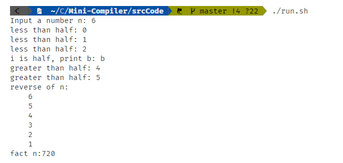


#### 6.2.3 数组测试

编译器实现了数组的数据结构。可以支持如下操作：

- 数组定义：需要指定数组类型和长度，如 int a[10]; 可以支持`int`和`char`类型的数组

- 数组赋值
  - 支持单个变量赋值：a[10] = 1
  - 支持数组整体赋值：a[10] = {1， 2， 3， 4， 5， 6， 7， 8， 9， 10}

编写测试代码如下：

```c
int main(){
    char a[5];
    a[5] = {'h', 'e', 'l', 'l', 'o'};
    int i;
    for(i = 0; i < 5; i = i + 1){
        cout << a[i];
    }
    cout << endl;
    int b[10];
    for(i = 0; i < 10; i = i + 1){
        b[i] = i * 2;
    }
    for(i = 0; i < 10; i = i + 1){
        cout << "b[" << i << "]:" << b[i] << endl;
    }
    return 0;
}
```

生成的与数组相关的中间代码如下：

定义时用`alloca`分配空间，取值时用`getelementptr`取出对应的值。

```llvm
  %b = alloca [10 x i32]
  %i = alloca i32
  %a = alloca [5 x i8]
  %0 = load [5 x i8], [5 x i8]* %a
  %1 = getelementptr [5 x i8], [5 x i8]* %a, i32 0, i32 0
  store i8 104, i8* %1
  %2 = getelementptr [5 x i8], [5 x i8]* %a, i32 0, i32 1
  store i8 101, i8* %2
  %3 = getelementptr [5 x i8], [5 x i8]* %a, i32 0, i32 2
  store i8 108, i8* %3
  %4 = getelementptr [5 x i8], [5 x i8]* %a, i32 0, i32 3
  store i8 108, i8* %4
  %5 = getelementptr [5 x i8], [5 x i8]* %a, i32 0, i32 4
  store i8 111, i8* %5
  store i32 0, i32* %i
```

生成可执行文件并执行，可以看到输出结果正确。

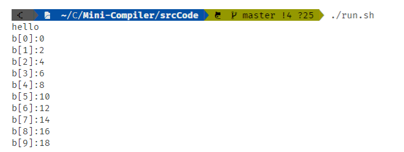


#### 6.2.4 结构体测试

编译器实现了结构体的数据结构。结构体类型需要在全局进行定义，然后在函数体中定义结构体变量。

结构体支持如下功能：

- 结构体类型定义：`struct + 结构体名{};`结构体中的变量支持`int`，`char`，`数组`等类型
- 结构体变量定义：`struct + 结构体名 + 变量名`。结构体变量也支持数组类型。
- 结构体赋值及运算：取出结构体中的元素用`.`取出

```c
struct Type{
    int id;
    char type;
    char name[3];
};

int main(){
    struct Type t, p[3];
    int i;
    for (i = 0; i < 3; i = i + 1){
        p[i].id = i;
        p[i].type = 'A';
        p[i].name[0] = 'a';
        p[i].name[1] = 'b';
        p[i].name[2] = 'c';
    }
    t = p[1];
    cout << "t.id = " << t.id << endl;
    cout << "t.type = " << t.type << endl;
    cout << "t.name = ";
    for(i = 0; i < 3; i = i + 1){
        cout << t.name[i];
    }
    cout << endl;
    return 0;    
}
```

生成的与结构体相关的中间代码如下：

- 结构体定义：

  ```llvm
  %Type = type { [3 x i8], i8, i32 }
  ```

- 结构体取值及赋值

  ```llvm
    %1 = getelementptr [3 x %Type], [3 x %Type]* %p, i32 0, i32 1
    %2 = load %Type, %Type* %1
    store %Type %2, %Type* %t
    %3 = getelementptr %Type, %Type* %t, i32 0, i32 2
    %4 = load i32, i32* %3
  ```

生成可执行文件并运行，可以看到运行结果正确。


#### 6.2.5 函数定义及调用

编译器实现了函数，支持`int`， `void`类型的函数，并支持数组传参。函数定义需要在main函数之前。编写测试代码如下：

```c++
void voidFunc(int array[]){
    array[1] = 1;
}

int addFunc(int a, int b)
{
    return a + b;
}

int main(){
    int a, b, c;
    a = 1;
    b = 2;
    c = addFunc(a, b);
    cout << "call addFunc: " << c << endl;
    int array[2];
    array[2]= {1, 2};
    cout << "before voidFunc: " << array[1] << endl;
    voidFunc(array[]);
    cout << "after voidFunc: " << array[1] << endl;
    return 0;
}
```

- voidFunc

  voidFunc的返回类型为void，且参数为int数组类型，可以看到参数类型为i32*。

  ```llvm
  define internal void @voidFunc(i32*) {
  entry:
    %array = alloca i32*
    store i32* %0, i32** %array
    %1 = load i32*, i32** %array
    %2 = getelementptr i32, i32* %1, i32 1
    store i32 1, i32* %2
    ret void
  }
  ```

  

- addFunc

  addFunc的类型为interger，参数类型也为intgeger，可以看到相应位置的定义为i32.

  ```llvm
  define internal i32 @addFunc(i32, i32) {
  entry:
    %a = alloca i32
    %b = alloca i32
    store i32 %0, i32* %b
    store i32 %1, i32* %a
    %2 = load i32, i32* %a
    %3 = load i32, i32* %b
    %addtmpi = add i32 %2, %3
    ret i32 %addtmpi
  }
  ```

  

- 函数调用

  - addFunc

    ```llvm
    %call = call i32 @addFunc(i32 %0, i32 %1)
    store i32 %call, i32* %c
    ```

  - voidFunc

    ```llvm
    %call2 = call void @voidFunc([2 x i32]* %array)
    ```


生成可执行文件并运行，可以看到输出结果正确。正确传入数组指针，数组的值在调用函数后被改变。

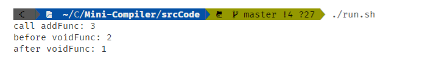


### 6.3 测试样例

#### 6.3.1 快速排序

##### 1. 问题描述

输入：第一行是一个整数 $N$ ，满足 $0 \leqslant N \leqslant 10^4$ 。接下来是 $N$ 个整数，每个整数独占一行。整数 $x_i$ 满足 $-10^4 < x_i < 10^4$ 但不保证 $i \ne j$ 时 $x_i \ne x_j$ 。

输出：要求将输入的 $N$ 个整数按非降序排序。计算结束后，需要将 $N$ 个整数依次输出，每个数字独占一行。注意最后一个数字输出后必须换行。

##### 2. 具体实现

由于题目要求必须使用[快速排序](https://en.wikipedia.org/wiki/Quicksort)算法解决该问题，并且必须使用递归形式的实现，因此我们将数组作为参数传入函数中，递归调用函数进行实现。

```c
void quicksort(int a[], int low, int high){
    int i, j, key, temp;
    int flag;
    flag = 0;
    i = low;
    j = high;
    key = a[low];
    if (low >= high){
        flag = 1;
    }
    if (flag == 0){
        while(low < high){
            while((low < high) && (key <= a[high])){
                high = high - 1;
            }
            if (key > a[high]){
                temp = a[low];
                a[low] = a[high];
                a[high] = temp;
                low = low + 1;
            }
            while((low < high) && (key >= a[low])){
                low = low + 1;
            }
            if (key < a[low]){
                temp = a[low];
                a[low] = a[high];
                a[high] = temp;
                high = high - 1;
            }
        }

        int newhigh, newlow;
        newhigh = low - 1;
        newlow = low + 1;
        quicksort(a, i, newhigh);
        quicksort(a, newlow, j);
    }

}

int main(){
    int a[10000];
    int n;
    cin >> n;
    int i, temp;
    for (i = 0; i < n; i = i + 1){
        cin >> temp;
        a[i] = temp;
    }
    temp = n - 1;
    quicksort(a[], 0, temp);
    for (i = 0; i < n; i = i + 1){
        cout << a[i] << endl;
    }
    return 0;
}
```


##### 3. 测试结果

测试输入样例得出结果如下：

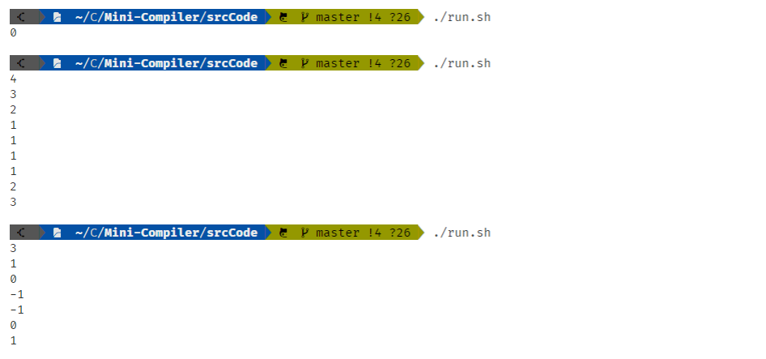

可以看到，以上输入输出均符合题意要求。运行测试工具通过测试：

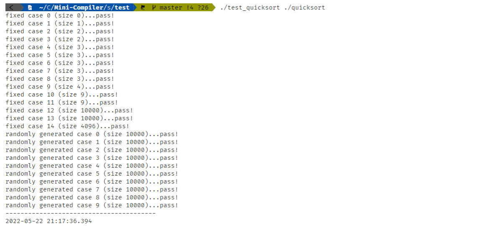

#### 6.3.2 矩阵乘法

##### 1. 问题描述

输入：两个矩阵 $A$ 和 $B$ 。每个矩阵输入的第一行是单个空格隔开的两个整数 $M$ 和 $N$ ，满足 $1 \leqslant M, N \leqslant 25$ ，分别代表了矩阵的行数和列数。接下来 $M$ 行，每行是 $N$ 个整数，整数之间使用一个以上空格隔开，并满足整数的位数（负号算一位）加上空格的数量等于 $6$ 。 整数全部在区间 $(-1000, 1000)$ 中。不保证 $A$ 和 $B$ 之间可以进行乘法操作。

输出：如果 $A$ 和 $B$ 的维度不满足乘法的要求（即 $N_A \ne M_B$ ），则输出 `Incompatible Dimensions` ，该信息独占一行（输出后需要换行）；否则，需要计算：

$$
\begin{aligned}
C & =
\begin{bmatrix}
c_{0, 0} & \dots & c_{0, N_C - 1} \\
c_{1, 0} & \dots & c_{1, N_C - 1} \\
\dots & \dots & \dots \\
c_{M_C - 1, 0} & \dots & c_{M_C - 1, N_C - 1} \\
\end{bmatrix}
= A B \\
& =
\begin{bmatrix}
a_{0, 0} & \dots & a_{0, N_A - 1} \\
a_{1, 0} & \dots & a_{1, N_A - 1} \\
\dots & \dots & \dots \\
a_{M_A - 1, 0} & \dots & a_{M_A - 1, N_A - 1} \\
\end{bmatrix}
\begin{bmatrix}
b_{0, 0} & \dots & b_{0, N_B - 1} \\
b_{1, 0} & \dots & b_{1, N_B - 1} \\
\dots & \dots & \dots \\
b_{M_B - 1, 0} & \dots & b_{M_B - 1, N_B - 1} \\
\end{bmatrix}
\end{aligned}
$$

其中：

$$
c_{i, j} = \sum_{k = 0}^{N_A - 1} a_{i, k} b_{k, j}
$$

计算完成后需要输出结果。结果分为 $M_C$ 行输出，每一行有 $N_C$ 个整数，每个整数前有数个空格，并满足整数的位数（负号算一位）加上空格的数量等于 $10$ 。

##### 2. 具体实现

在我们编写的代码中，我们使用一维数组来表示矩阵，并进行矩阵的乘法计算。格式化输出使用`setw(10)`来输出。

```c
int main(){
    int M1,N1,M2,N2;
    cin>>M1>>N1;
    int n1;
    n1=M1*N1;
    int A[625];
    int i,j,k,temp;
    for(i=0;i<M1;i=i+1){
        for(j=0;j<N1;j=j+1){
            k=i*N1+j;
            cin>>temp;
            A[k]=temp;
        }
    }
    cin>>M2>>N2;
    int n2;
    n2=M2*N2;
    int B[625];
    for(i=0;i<M2;i=i+1){
        for(j=0;j<N2;j=j+1){
            k=i*N2+j;
            cin>>temp;
            B[k]=temp;
        }
    }

    int n3;
    n3=M1*N2;
    int C[625];
    int x,y,z,t;
    if(N1!=M2){
        cout<<"Incompatible Dimensions"<<endl;
    }
    else{
        for(i=0;i<M1;i=i+1){
            for(j=0;j<N2;j=j+1){
                z = 0;
                for(k=0;k<N1;k=k+1){
                    t=i*N1+k;
                    x=A[t];
                    t=k*N2+j;
                    y=B[t];
                    z= z + x*y;
                    t=i*N2+j;
                    C[t]=z;
                }
            }
        }

        for(i=0;i<M1;i=i+1){
            for(j=0;j<N2;j=j+1){
                t=i*N2+j;
                cout<< setw(10) << C[t];
            }
            cout<<endl;
        }
    }
    return 0;
}
```


##### 3. 测试结果

测试输入样例得出结果如下：

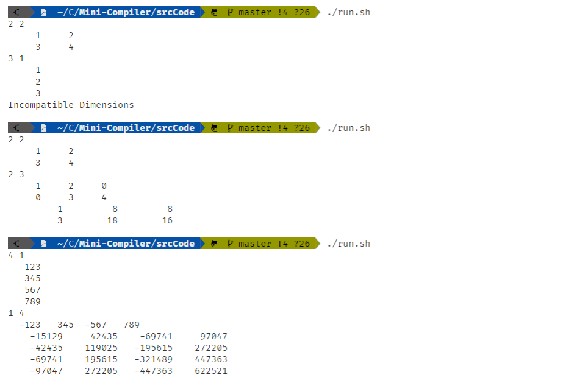

可以看到，以上输入输出均符合题意要求。运行测试工具通过测试：

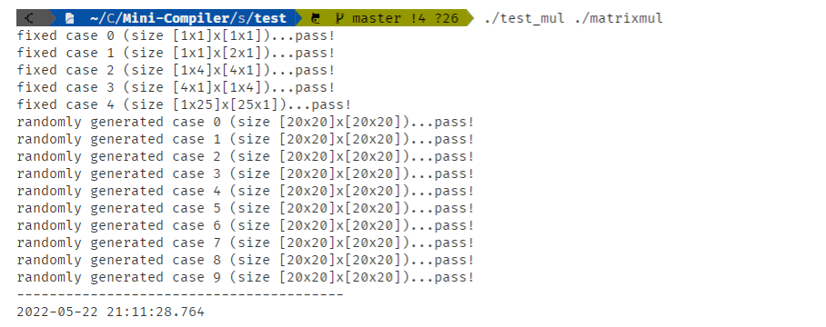

#### 6.3.3 选课助手

##### 1. 问题描述

选课助手的问题描述较为繁琐，主要是要通过输入的课程表信息得到以下信息：

- GPA ，使用四分制，其中 `A` 等于 4 ， `B` 等于 3 ， `C` 等于 2 ， `D` 等于 1 ， `F` 等于 0 ，结果保留一位小数，格式匹配正则表达式 `[0-3]\.[0-9]|4\.0` 。计算公式为：$GPA = (\sum \text{成绩} \times \text{学分}) / \text{尝试学分}$ 。
- 尝试学分，已经获得成绩的课程的总学分。包括获得 `F` 成绩的课程。
- 已修学分，已经获得的总学分。成绩为 `F` 的课程没有获得学分。
- 剩余学分，培养方案中还有多少学分没有修读，包括成绩为 `F` 的课程。
- 推荐课程，满足前置课程条件，可以修读的课程但还没有获得学分的课程。必须按照课程出现在输入中的先后顺序进行输出。

##### 2. 具体实现

在本题中，我们使用了结构体来存放每门课的信息，包括课程名称、学分、前置条件、是否已修读等，并使用了结构体数组来存放所有课程的信息：

```c++
struct Course {
    char courseName[5];
    int learned;
    int courseNameSize;
    char pre[10000];
    int length;
};
struct Course type1[100];
```

为了方便字符串之间的比较，我们设计了哈希函数，将字符串映射到整数上进行比较

```c++
int HashFunc(char key[], int TableSize,int size){
    int HashVal;
    HashVal= 0;
    int i;
    i=0;
    while(i!=size){
        int t;
        t = key[i];
        HashVal = HashVal*32 + t;
        i = i+1;
    }
    int quotient;
    quotient = HashVal / TableSize;
    int rem;
    rem = HashVal - quotient*TableSize;
    return rem;
}
```

设计了如上数据结构和函数后，我们将读入的每一行字符都存放到对应的课程结构体中，根据是否获得学分来判断其是否已修读，之后循环遍历所有课程来判断其是否已修读过、是否满足前置条件，并进行对应的输出。


##### 3. 测试结果

对测试样例进行测试，得到以下结果：

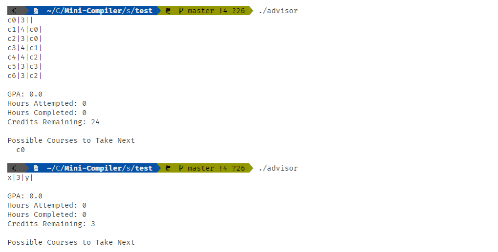

可以看到，输出结果均正确。其中第一个测试样例所有课程都未修读，将根据依赖关系给出推荐课表。而第二个测试样例没有推荐课表，推荐课表处输出为空。

运行测试工具通过测试：

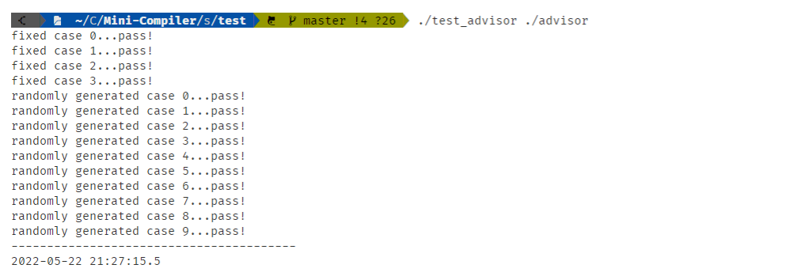

### 7. 总结